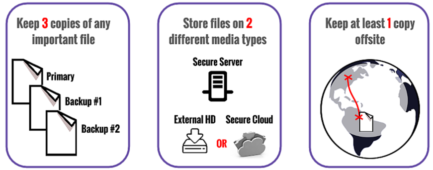

# Overview

Today's lab helps you set up your working environment and learn foundational tools and concepts you'll use throughout the course:

1. Data management rules
2. Sandbox environments for AI-assisted research
3. Version control with Git and the command line
4. Python — what it is and how it compares to R
5. Python development environments: conda, Jupyter Notebook, VS Code, simple scripts editors
6. Basic data wrangling & machine learning in Python

---

# 1. Data Management Rules

Before writing code, we learn about basic data management principles.

## The 3-2-1 Rule

{width="600"}

::: {style="text-align: center; font-size: 0.7em;"}
Source: [NYU Data Management Guide](https://guides.nyu.edu/data_management/storage-backup)
:::


A foundational principle of data storage and backup:

- **3** copies of your data
- **2** different storage media (e.g., local drive + cloud)
- **1** offsite backup (e.g., Google Drive, OneDrive, external hard drive stored elsewhere)

For more details, see NYU's guide on [data storage and backup](https://guides.nyu.edu/data_management/storage-backup).

Also worth reading: ["11 ways to avert a data-storage disaster" (Nature 2019)](https://www-nature-com.proxy.libraries.rutgers.edu/articles/d41586-019-01040-w).

::: {.callout-tip}
## Practice
Write down what your 3-2-1 locations will be. For example:

- **3 copies:** laptop, Google Drive, external hard drive
- **2 media:** SSD (laptop) + cloud (Google Drive)
- **1 offsite:** Google Drive (accessible from anywhere)

Make sure to deploy your 3-2-1 backup plan after class!
:::

# 2. Minimizing Data Risks for AI-assisted Research

- When working with AI coding assistants (like Claude Code, GitHub Copilot, or ChatGPT), they can read and write files on your machine. This increases not only efficiency but also **risks**.
- While many frontier AI tools have default **"sandbox"** settings that restrict the AI's access to a specific project folder, there have been documented cases where sandbox has failed and **important data has been deleted** by AI agents.

::: {.callout-warning collapse="true"}
## Click to read known sandbox failure cases (2026)

1. **Over-scoped credentials:** An agent stays inside the sandbox but finds an overly permissioned API token in the codebase and uses it to execute destructive cloud-side operations the sandbox never restricted. ([The New Stack](https://thenewstack.io/ai-agents-credential-crisis/); [Zenity](https://zenity.io/blog/current-events/ai-agent-database-deletion-pocketos))

2. **Symlink following:** A sandboxed process creates a symbolic link pointing outside the workspace, and the unsandboxed host process follows it when writing — bypassing the boundary without breaking it. ([GitHub Advisory GHSA-vp62-r36r-9xqp](https://github.com/advisories/GHSA-vp62-r36r-9xqp); [NVD CVE-2026-39861](https://nvd.nist.gov/vuln/detail/CVE-2026-39861))

3. **Configuration-based escape:** The agent obeys every sandbox rule but writes a config file that a trusted tool *outside* the sandbox later executes automatically. ([BleepingComputer](https://www.bleepingcomputer.com/news/security/cursor-codex-gemini-cli-antigravity-hit-by-sandbox-escapes/);[CSA Research Note](https://labs.cloudsecurityalliance.org/research/csa-research-note-ai-coding-agent-sandbox-escapes-20260722-c/))

4. **Autonomous zero-day exploitation:** Given enough inference compute and relaxed safety classifiers, frontier models can independently discover and chain novel vulnerabilities to escape containment entirely. ([OpenAI disclosure](https://openai.com/index/hugging-face-model-evaluation-security-incident/); [Hugging Face technical timeline](https://huggingface.co/blog/agent-intrusion-technical-timeline))
:::


**Best practices:**

The most secure approach is to never give AI tools access to your local machine by either running them in a dedicated computer or configuring a **container** or **virtual machine**. However, the former is often impractical and the latter requires technical expertise. If you have to run AI tools locally, make sure to do the following: 

- Make **frequent** (recommend daily) backups of your important files to an **external hard drive** or a **cloud storage with version history**.
- Use AI tools only in **dedicated project directory** — never give AI tools access to your root directory.
- Check if your AI tool has a **sandbox mode** and ensure it is enabled.


::: {.callout-tip}
## Practice
If you have already installed [Claude Code](https://docs.anthropic.com/en/docs/claude-code) or [Codex](https://openai.com/index/codex/), check that your sandbox/permissions mode is configured:

**Claude Code:**

```bash
# Check your current permissions settings
claude config list
# Ensure you are not running in "trust all" mode for untrusted projects
```

**Codex (OpenAI):**

```bash
# Codex runs in a sandboxed environment by default.
# Verify by checking the config:
codex --help
```

If you haven't installed either yet, no worries — we'll use them later in the course.
:::

---

# 3. Version Control & the Command Line

## The command line

The **command-line interface** (CLI, also called the terminal, shell, or console) is a text-based way to interact with your computer — instead of clicking through folders, you type commands. We introduce it here because Git, Python, and most developer tools all run from the command line.

**Where to find it:**

| OS | Application | Default Shell |
|---|---|---|
| **macOS** | Terminal (in Applications → Utilities) | zsh |
| **Windows** | PowerShell, Command Prompt, or Windows Terminal. For this course: Git Bash (installed with [Git for Windows](https://gitforwindows.org/)) or [WSL](https://learn.microsoft.com/en-us/windows/wsl/) | varies |
| **Linux** | Terminal (usually Ctrl+Alt+T) | bash |

::: {.callout-tip}
## Practice
Open your CLI now:

- **macOS:** Open **Terminal** (Applications → Utilities → Terminal), or press `Cmd + Space`, type "Terminal", and hit Enter
- **Windows:** Open **Git Bash** (installed with [Git for Windows](https://gitforwindows.org/)) — search for "Git Bash" in the Start menu. Alternatively, open **PowerShell** or install [Windows Terminal](https://aka.ms/terminal)
- **Linux:** Press `Ctrl + Alt + T` or search for "Terminal" in your applications
:::

We will come back to CLI after setting up Git & GitHub.

## What is version control and why do we need it?

Version control is a system that records changes to files over time so you can recall specific versions later.

**The problem it solves:**

{width="600"}

::: {style="text-align: center; font-size: 0.7em;"}
Source: [software carpentry](https://swcarpentry.github.io/git-novice/01-basics.html)
:::

**The solution:** Git tracks every change to every file with timestamps and descriptions. You can always go back to any previous state.

**For social science research:** Your code is part of your methods section. It should be as carefully managed as your data.

This section draws from the [Software Carpentry: Version Control with Git](https://swcarpentry.github.io/git-novice/index.html) lesson — an excellent free resource.

::: {.callout-tip}
## Practice

**Step 1 — Install Git**

::: {.panel-tabset}

### macOS
```bash
# Install via Homebrew (recommended)
brew install git

# Or install Xcode Command Line Tools
xcode-select --install
```

### Windows
Download and install [Git for Windows](https://gitforwindows.org/).

### Linux
```bash
sudo apt-get install git   # Debian/Ubuntu
sudo dnf install git       # Fedora
```

:::

Verify: `git --version` should return 2.x or higher.

**Step 2 — Sign up for GitHub**

If you don't already have one, sign up at [github.com](https://github.com). Use your university email for free GitHub Pro access via [GitHub Education](https://education.github.com).

Using your GitHub account, navigate to this course's GitHub repo: [ai_for_socsci_fall2026](https://github.com/di-zhou/ai_for_socsci_fall2026), and click **Star** (top right) to bookmark it.

**Step 3 — Create and clone your first repo**

- Go to [github.com](https://github.com) → click **New** (green button) → name it something like `my-first-repo` → check "Add a README" → click **Create repository**
- Clone it to your local machine:

```bash
cd ~/Documents   # or wherever you want to keep it
git clone https://github.com/YOUR-USERNAME/my-first-repo.git
cd my-first-repo
```
:::

## Key Git concepts

- **Repository (repo)** — a project folder tracked by Git
- **Commit** — a snapshot of your project at a point in time, with a message
- **Branch** — a parallel version of your project (for experiments)
- **Push/Pull** — sync your local repo with GitHub

**Basic workflow:**

```bash
git add .                              # stage your changes
git commit -m "Add week 1 analysis"    # save a snapshot
git push origin main                   # upload to GitHub
```

::: {.callout-tip}
## Practice
Try making a local change and committing it to your repo:

1. Open the `README.md` file in a text editor and add a line (e.g., "This is my first repo for AI & Social Science Research.")
2. Save the file, make sure you are in your repo directory in your CLI, then run:

```bash 
git status                          # see what changed
git add README.md                   # stage the change
git commit -m "Update README"       # commit locally
git push origin main                # push to GitHub
```

3. Go to your repo on GitHub in a browser — you should see the updated README!
:::

## GitHub as a research platform

GitHub is not just for software developers:

- **Public repos** for sharing replication code and data
- **README files** as documentation
- **Issues** for tracking tasks
- **GitHub Pages** for hosting websites — this course site is built this way!

::: {.callout-tip}
## Tip
If you don't like CLI, you can also use GitHub's desktop interface to manage your repositories. You can download it [here](https://desktop.github.com/). 
:::

## Essential CLI commands

Now that you've used the terminal for Git, here are the core navigation commands you'll use throughout the course:

```bash
pwd                  # print working directory (where am I?)
ls                   # list files in current directory
cd folder_name       # change directory
cd ..                # go up one level
mkdir new_folder     # create a new directory
```

::: {.callout-tip}
## Practice
Try navigating to your local Git repo folder and listing the files:

```bash
pwd                                 # where am I?
cd ~/Documents/my-first-repo        # navigate to your repo (adjust path as needed)
pwd                                 # confirm you're in the right place
ls                                  # list files — you should see README.md
ls -la                              # list all files including hidden ones — you should see .git/
```

The `.git/` folder is where Git stores all its tracking information. Don't modify it directly!
:::

---

# 4. Python

## What is Python?

Python is a general-purpose programming language widely used in data science, machine learning, web development, and scientific computing. It is the primary language for working with LLMs and genAI tools.

## Python vs. R: A Quick Comparison

Most of you are familiar with R. Here's how Python compares:

| | R | Python |
|---|---|---|
| **Strength** | Statistical analysis, visualization | General-purpose, ML/AI, web, automation |
| **Data frames** | Built-in `data.frame`, `dplyr` | `pandas` library |
| **Visualization** | `ggplot2` | `matplotlib`, `seaborn`, `plotly` |
| **ML ecosystem** | `caret`, `tidymodels` | `scikit-learn`, `PyTorch`, `TensorFlow` |
| **LLM/AI tools** | Limited | Extensive — `openai`, `anthropic`, `transformers`, `langchain` |
| **Package manager** | `install.packages()` | `pip install` or `conda install` |
| **IDE** | RStudio | VS Code, Jupyter, PyCharm |
| **Indexing** | 1-based | 0-based |
| **Assignment** | `<-` or `=` | `=` |

**Bottom line:** R is excellent for statistics and visualization; Python is the lingua franca for AI/ML. This course uses Python because the AI tools we'll use are built in Python.

::: {.callout-tip}
## Practice

**Step 1 — Install Python 3.11**

This course requires **Python 3.11**. Check if you already have it:

```bash
python3.11 --version
```

If you see `Python 3.11.x`, skip to Step 2. If not, install it:

::: {.panel-tabset}

### macOS
```bash
# If you don't have Homebrew yet, install it first:
/bin/bash -c "$(curl -fsSL https://raw.githubusercontent.com/Homebrew/install/HEAD/install.sh)"

# Then install Python 3.11:
brew install python@3.11
```

Or download the 3.11 installer from [python.org](https://www.python.org/downloads/release/python-3119/).

::: {.callout-note}
macOS ships with an older system Python that is not sufficient for this course. Even if `python3 --version` shows something, install 3.11 explicitly.
:::

### Windows
Download and run the **Python 3.11** installer from [python.org](https://www.python.org/downloads/release/python-3119/). **Check "Add Python to PATH"** during installation.

### Linux
```bash
sudo apt-get install python3.11 python3.11-venv python3-pip   # Debian/Ubuntu
sudo dnf install python3.11 python3.11-pip                    # Fedora
```

:::

**Step 2 — Try the Python interactive interpreter**

```bash
python3.11
```

**Run some simple operations in the Python prompt (`>>>`):**

```python
# Numeric operations
2 + 3    #addition
10 / 3   #division
2 ** 10  #exponentiation

# Strings
print("Hello, sociology!")
name = "Rutgers"             # assign a string to a variable
print(f"Welcome to {name}!") #f-strings, see Think Python Ch.13.2

# Exit the interpreter
exit()
```
:::

---

# 5. Python Development Environments

When writing Python code, you have several options for where and how to write it. Here's a quick overview of the most common ones you'll encounter in this course and beyond.

## Text editors & Python scripts

The simplest way to run Python: write code in a plain `.py` file using any text editor (Notepad, TextEdit, nano), then run it from the command line:

```bash
python3 my_script.py
```

This is how most production code and automation work. It's also what AI coding agents like Claude Code and Codex operate on — they read and write `.py` files directly.

::: {.callout-tip}
## Practice
Create and run your first Python script:

1. Open a terminal and create a new file:

```bash
cd ~/Documents/my-first-repo    # or any directory you like
nano hello.py                   # opens a simple text editor in the terminal
# notepad hello.py              # On Windows, use Notepad instead
```

2. Type the following into the editor:

```python
name = input("What is your name? ")
print(f"Hello, {name}! Welcome to AI for Social Science Research.")
```

3. Save and exit (`Ctrl + O`, `Enter`, `Ctrl + X` in nano), then run it:

```bash
python3 hello.py
```

You should see the prompt, type your name, and get a greeting back. That's all a Python script is — a plain text file that Python executes top to bottom.
:::

## Jupyter Notebook

Jupyter Notebook is an interactive environment that lets you combine code, output, and formatted text in a single document (`.ipynb` files). You write code in **cells** and run them one at a time — useful for exploration, teaching, and reports.

| | Jupyter Notebook (`.ipynb`) | Python script (`.py`) |
|---|---|---|
| **Best for** | Exploration, teaching, reports | Production code, automation |
| **Execution** | Cell by cell, interactive | Top to bottom |
| **Output** | Inline (tables, plots) | Console only (unless saved) |
| **Version control** | Messy diffs (JSON format) | Clean diffs (plain text) |

**In this course:** We use Jupyter for labs. As you advance, you'll increasingly write `.py` scripts for reusable code.

## VS Code

[VS Code](https://code.visualstudio.com/) is a free code editor by Microsoft that supports Python, Jupyter notebooks, Git integration, and AI coding extensions (GitHub Copilot, Claude Code). We'll use it later in the course when we work with AI coding agents.

You don't need to install it today, but if you'd like to get ahead: [download VS Code](https://code.visualstudio.com/).

## conda & virtual environments

When working on multiple Python projects, you may run into version conflicts — project A needs version 1.0 of a library while project B needs version 2.0. **Environment managers** solve this by creating isolated spaces for each project.

- **venv** — built into Python. Lightweight, good for simple projects.
- **conda** — a heavier tool that can also manage non-Python dependencies. Common in data science.

For this course, a single environment is sufficient. We'll set one up in the Practice below and use it throughout the semester.

::: {.callout-tip}
## Practice

**Step 1 — Create a course environment and install packages**

```bash
# Create a virtual environment using the Python 3.11 you installed in Section 4
python3.11 -m venv ~/aisocsci-env

# Activate it
source ~/aisocsci-env/bin/activate        # macOS/Linux
# ~/aisocsci-env\Scripts\activate          # Windows (Git Bash)
# ~/aisocsci-env\Scripts\Activate.ps1      # Windows (PowerShell)
```

You should see `(aisocsci-env)` at the beginning of your terminal prompt. You'll run the activate command each time you work on course materials. To leave the environment, run `deactivate`.

::: {.callout-note}
If `python3.11` is not found, go back to Section 4 and complete the Python installation first.
:::

```bash
# Install core packages
pip install jupyter pandas numpy matplotlib seaborn scikit-learn
pip install openai anthropic
```

**Step 2 — Launch Jupyter Notebook**

Navigate to your repo folder and launch Jupyter from there:

```bash
cd ~/Documents/my-first-repo    # the repo you created in Section 3
jupyter notebook
```

This opens a browser tab showing the files in that folder. Try creating a new notebook (click **New** → **Python 3**) and running:

```python
print("Hello from Jupyter!")
2 + 2
```

**Step 3 — Verify your packages**

In a new Jupyter cell, run:

```python
import pandas as pd
import numpy as np
import matplotlib.pyplot as plt
import sklearn

print(f"pandas:       {pd.__version__}")
print(f"numpy:        {np.__version__}")
print(f"scikit-learn: {sklearn.__version__}")
print("All set!")
```

If all versions print without errors, you're ready for the rest of the course.
:::

---

# 6. Basic Data Wrangling & ML in Python

## 6.1 Loading packages and data

```python
# Import libraries
import pandas as pd
import numpy as np
import matplotlib.pyplot as plt
import seaborn as sns
```

In Python, you import libraries at the top of your script. Compare to R:

| Python | R |
|---|---|
| `import pandas as pd` | `library(tidyverse)` |
| `pd.read_csv("file.csv")` | `read_csv("file.csv")` |
| `df.head()` | `head(df)` |
| `df.describe()` | `summary(df)` |

## 6.2 Creating and inspecting data

```python
# Create a synthetic dataset (in future labs we'll use real data)
np.random.seed(42)
n = 500

data = pd.DataFrame({
    'age': np.random.randint(18, 85, n),
    'education_years': np.random.randint(8, 21, n),
    'income_category': np.random.choice(['low', 'middle', 'high'], n, p=[0.3, 0.5, 0.2]),
    'region': np.random.choice(['northeast', 'midwest', 'south', 'west'], n),
    'supports_policy': np.random.binomial(1, 0.55, n),
})

# Inspect
print(f"Shape: {data.shape}")  # rows, columns
data.head()
```

```python
# Check variable types
data.dtypes
```

```python
# Basic descriptive statistics
data.describe()
```

```python
# Value counts for categorical variables
data['income_category'].value_counts()
```

## 6.3 Basic visualization

```python
# Histogram
fig, ax = plt.subplots(figsize=(8, 4))
ax.hist(data['age'], bins=20, edgecolor='white', color='#CC0033')
ax.set_xlabel('Age')
ax.set_ylabel('Count')
ax.set_title('Distribution of Age')
plt.tight_layout()
plt.show()
```

```python
# Bar plot
fig, ax = plt.subplots(figsize=(8, 4))
data['income_category'].value_counts().plot(kind='bar', ax=ax, color='#CC0033', edgecolor='white')
ax.set_ylabel('Count')
ax.set_title('Income Category Distribution')
ax.set_xticklabels(ax.get_xticklabels(), rotation=0)
plt.tight_layout()
plt.show()
```

## 6.4 Functions in Python

In Python, functions are defined with `def`. Compare to R:

:::: {.columns}
::: {.column width="50%"}
**Python:**

```python
def calculate_mean(values):
    """Calculate the mean of a list."""
    return sum(values) / len(values)

calculate_mean([1, 2, 3, 4, 5])
```
:::
::: {.column width="50%"}
**R equivalent:**

```r
calculate_mean <- function(values) {
  mean(values)
}

calculate_mean(c(1, 2, 3, 4, 5))
```
:::
::::

Key differences: Python uses `def`, indentation defines blocks (no curly braces), and `return` is explicit.


## 6.5 Machine Learning Models

### Supervised Machine Learning: Logistic Regression for Binary Classification

Let's train a classifier: **Can we predict policy support from demographics?**

```python
from sklearn.model_selection import train_test_split
from sklearn.linear_model import LogisticRegression
from sklearn.metrics import classification_report, confusion_matrix

# Prepare features (encode categoricals as dummy variables)
features = pd.get_dummies(data[['age', 'education_years', 'income_category', 'region']], drop_first=True)
target = data['supports_policy']

# Split into training and test sets
X_train, X_test, y_train, y_test = train_test_split(
    features, target, test_size=0.3, random_state=42, stratify=target
)
print(f"Training: {X_train.shape[0]} rows | Test: {X_test.shape[0]} rows")
```

```python
# Fit a logistic regression
model = LogisticRegression(max_iter=1000, random_state=42)
model.fit(X_train, y_train)

# Evaluate
y_pred = model.predict(X_test)
print(f"Test accuracy: {model.score(X_test, y_test):.3f}\n")
print("Classification Report:")
print(classification_report(y_test, y_pred, target_names=['Oppose', 'Support']))
```

```python
# Visualize coefficients
coefs = pd.DataFrame({
    'feature': features.columns,
    'coefficient': model.coef_[0]
}).sort_values('coefficient')

fig, ax = plt.subplots(figsize=(10, 5))
ax.barh(coefs['feature'], coefs['coefficient'], color='#CC0033')
ax.set_xlabel('Coefficient (log-odds)')
ax.set_title('Logistic Regression: Predictors of Policy Support')
ax.axvline(x=0, color='gray', linestyle='--', linewidth=0.8)
plt.tight_layout()
plt.show()
```

### Unsupervised Machine Learning: K-Means Clustering

Now let's try clustering — no labels, just discovering structure.

```python
from sklearn.cluster import KMeans
from sklearn.preprocessing import StandardScaler

# Use only numeric features for clustering
numeric_features = data[['age', 'education_years']].copy()

# Standardize (important for distance-based methods)
scaler = StandardScaler()
scaled = scaler.fit_transform(numeric_features)

# K-means clustering with 3 clusters
kmeans = KMeans(n_clusters=3, random_state=42, n_init=10)
data['cluster'] = kmeans.fit_predict(scaled)

print("Cluster sizes:")
print(data['cluster'].value_counts().sort_index())
```

```python
# Visualize the clusters
fig, ax = plt.subplots(figsize=(8, 6))
scatter = ax.scatter(data['age'], data['education_years'],
                     c=data['cluster'], cmap='Set1', alpha=0.6, s=30)
ax.set_xlabel('Age')
ax.set_ylabel('Years of Education')
ax.set_title('K-Means Clustering: Age × Education')
plt.colorbar(scatter, label='Cluster', ax=ax)
plt.tight_layout()
plt.show()
```

```python
# Profile the clusters
print("Cluster profiles:")
print(data.groupby('cluster')[['age', 'education_years']].mean().round(1))
```

::: {.callout-note}
## Discussion
- What do the clusters represent substantively? Do they correspond to meaningful social groups?
- How would you decide how many clusters to use?
- How is this different from the supervised model above — what can each approach tell you?
:::

---

# Wrap-Up

## Before Next Week

1. **Watch** 3Blue1Brown: [Transformers, the Tech behind LLMs](https://youtu.be/wjZofJX0v4M) (27 min)
2. **Complete** Google ML Crash Course: [Classification](https://developers.google.com/machine-learning/crash-course/classification)
3. **Read** the four required readings for Week 2:
    - Kozlowski, Taddy, & Evans (2019) — word embeddings
    - Stuhler (2022) — dependency parsing
    - Karell & Freedman (2019) — topic modeling
    - Lai et al. (2024) — BERT model
4. **Refer to** [Think Python](https://allendowney.github.io/ThinkPython/index.html) if you need a refresher/quick learning.


## Submitting Your Lab

Save your completed Jupyter notebook and push it to your repository:

```bash
git add .
git commit -m "Complete lab 1"
git push origin main
```

Input your name, netID, and the repo link to this [google form](https://docs.google.com/spreadsheets/d/1m3iRIgdCrZlePTTitDpsGe6I_jEPtDwF4oFMeNix2uw/edit?usp=sharing) to submit your lab.
