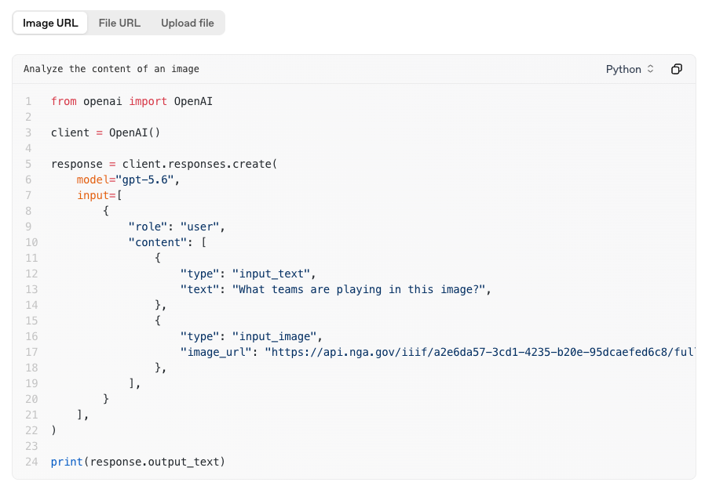
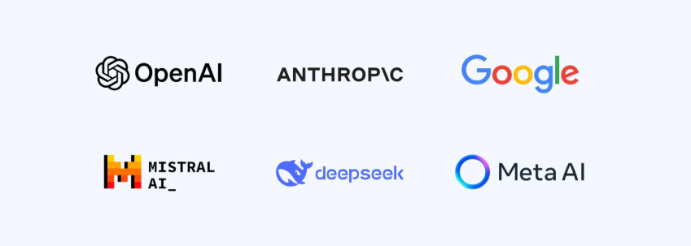
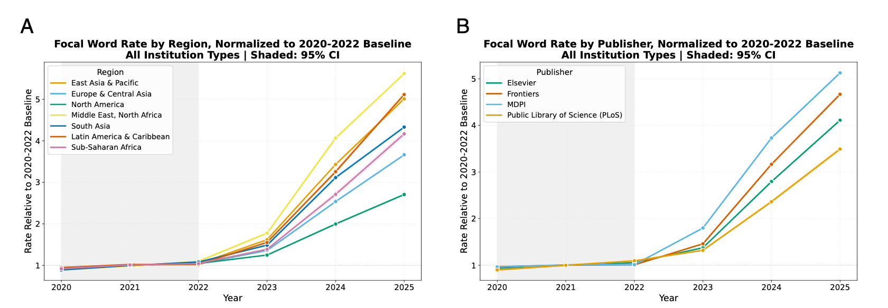
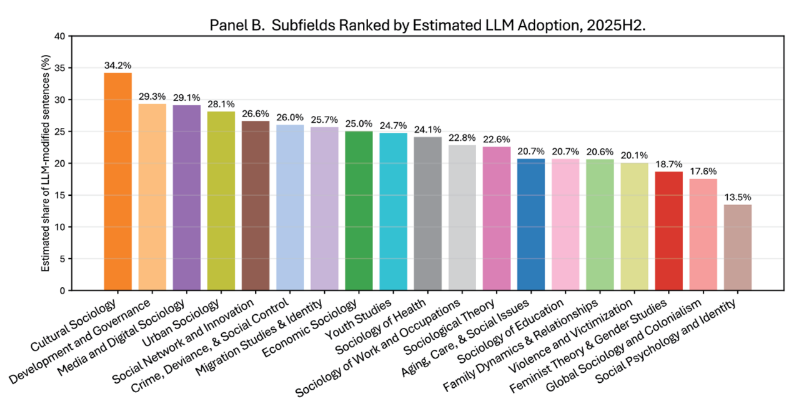
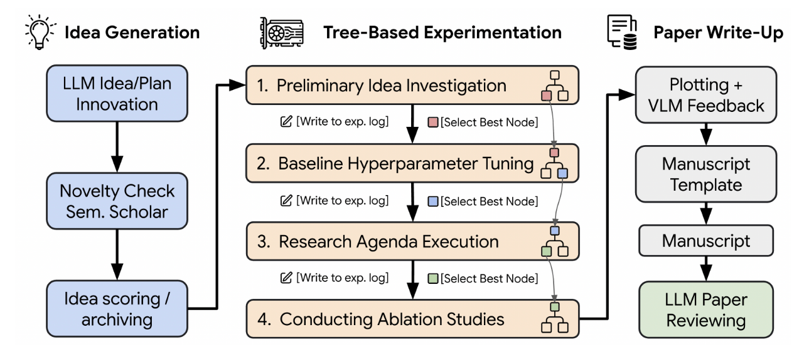
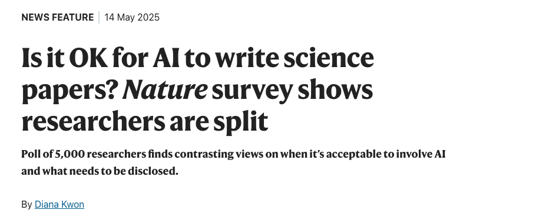
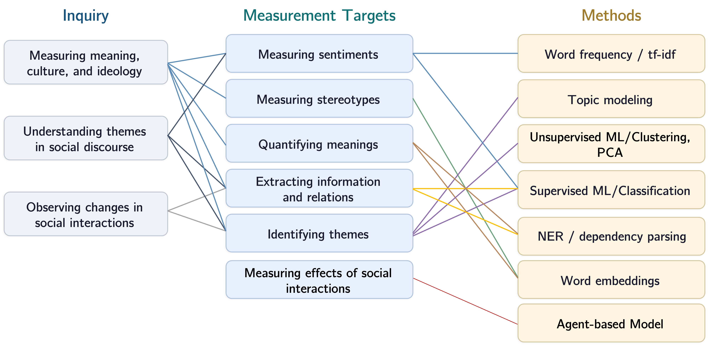
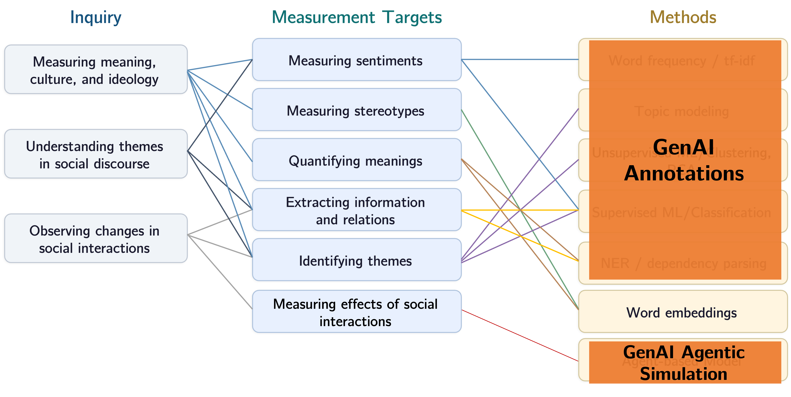
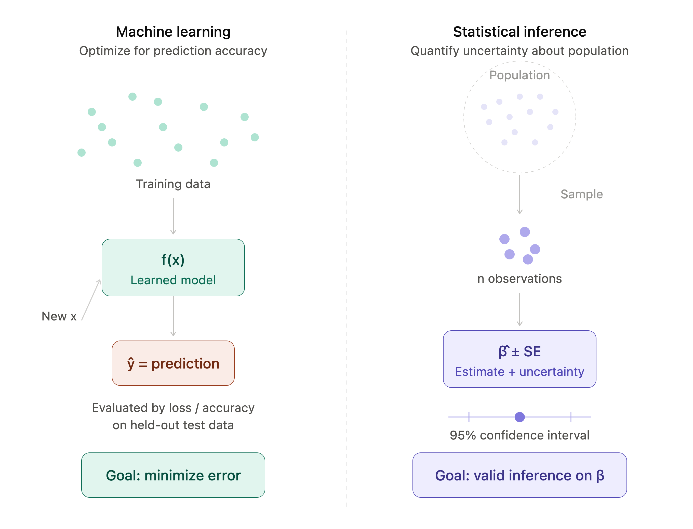

## Plan of Today

- **Lecture: course logistics** ~20min 
- **Getting to know each other**: ~10min
- **Break**: 15min — form groups for reading presentations
- **Lecture: Generative AI in social science research** ~30 min
- **Break**: 15min — form groups for reading presentations
- **Lecture: Statistical learning & machine learning basics** ~15 min
- **Lab** ~55 min — environment setup, version control, Python basics, and first steps in data wrangling & machine learning

# Part I. Course Intro & Logistics {.center background-color="#CC0033"}

## Course Logistics

- **Course:** 16:920:574:M1 Topics in Sociology — AI and Social Science Research
- **Term:** Fall 2026, 7-week minicourse (Sep. 2 – Oct. 14)
- **Meeting time:** Wednesdays 2:00–4:40 pm, Davison 128
- **Office hours:** Wednesdays 1:00–2:00 pm, Davison 137 — sign up link on syllabus & course website
- **Office hours:** Contact me via email: di.zhou@rutgers.edu
- **Course website:** [https://di-zhou.github.io/ai_for_socsci_fall2026/](https://di-zhou.github.io/ai_for_socsci_fall2026/)  

. . .

**Add/drop:** This is a 7-week minicourse: Consult the DGS for add/drop policies.

## Course Objectives

By the end of this course, you should be able to:

1. Understand **current applications of genAI tools in sociological research**, and form **your own evaluations** on their effectiveness.

. . .

2. Know how to **use genAI tools for your own research**.

. . .

3. Understand what genAI **can and cannot do** for producing high-quality research.

## 7-Week Roadmap

::: {style="font-size: 0.8em;"}

| Week | Date | Topic | Format |
|------|------|-------|--------|
| **1** | **Sep. 2** | **Introduction & Set-up** | **Lecture + Lab** |
| 2 | Sep. 9 | Computational Methods & LLM Basics | Lecture + Lab |
| 3 | Sep. 16 | Text, Image & Video Annotation | Presentation + Lecture + Lab |
| 4 | Sep. 23 | Simulating Subjects & Agents | Presentation + Lab + Co-work |
| 5 | Sep. 30 | AutoResearch | Presentation + Lab + Discussion |
| 6 | Oct. 7 | Qualitative Research | Presentation + Co-work |
| 7 | Oct. 14 | Final Presentations | Presentations |
|   | Oct. 18 | Final Project Deliverables Due |  |

:::

## Assessment

| Component | Share | How to earn points |
|---|--|-----|
| Participation | 15% | Attend, ask questions, share thoughts on readings → use guiding questions on syllabus |
| Lab Assignments | 15% | Complete lab exercises in class; submit evidence of completion after class if you need extra time |
| Reading Presentation | 20% | Group of 2–3, ~20 min, Weeks 3–6 — **sign up today!** |
| Final Project Presentation | 20% | ~10 min + 5 min Q&A, Week 7 |
| Final Project Deliverables | 30% | Proposal or report |

## Final Project: Three Tracks

Your project must fulfill **at least one** of the requirements:

1. The research **uses genAI/LLM** as part of its research methods.
2. The research is **about** the usage or applications of genAI/LLM.
3. The research **tests/pilots** genAI/LLM tools for one of your ongoing research projects.

. . .

**Deliverables:**

- Types (1) or (2): project proposal, ≥8 pages (double-spaced, 12pt)
- Type (3): project report (~5 pp.) + reflection (~5 pp.) + code/appendix

**Timeline:** Co-work on Weeks 4 & 6 → Presentations on Week 7 → Final deliverable due on Oct. 18th. 

. . .

Come **talk to me** if you are unsure about your project idea or which track to choose.

## AI Usage Policy

::: {.callout-important}
## AI writing is strictly banned

You are **not allowed to use AI to generate any writing assignments** for this course.
:::

. . .

::: {style="font-size: 0.8em;"}
**Permitted:**

- Grammar corrections only: see syllabus for allowed scenarios.
- Using genAI as a **research tool** or **subject of research**.
:::

. . .

::: {style="font-size: 0.8em;"}
**Rule of thumb:** Do not automate the process of **learning, thinking, and writing**.  
:::

. . .

::: {.callout-tip}
## Forming a AI-free writing habit

Turn off AI writing features & word suggestions in your browsers & word processors (e.g., Grammarly/Copilot extensions for Outlook, Gmail, Microsoft Word, Google Docs, etc.). It is "easy" to let AI write for you, but difficult to go back. Thinking & writing clearly is a scholar's most important weapon, and you do not want to let it rust!
:::

. . .

::: {style="font-size: 0.8em;"}
**You** are held responsible to follow this AI policy. See syallbus for more details on the AI usage policy.
:::

## Some Prerequisites

- **Bring your laptop** to every lab.
- **Purchase Claude Pro or ChatGPT Plus**: if you don't want to commit — sign up ~mid-September for 1 month ($20) & cancel after.
- **Python** proficiency not required, but since it is the language used for most computational tasks in this course, you are expected to be able to understand Python scripts. A good learning resource is the [Think Python](https://allendowney.github.io/ThinkPython/index.html) book. You can also use genAI to help you learn Python codes. 

# Questions? {.center background-color="#CC0033"}

<!-- Part 2: getting to know each other 2:20–2:30 -->

## Getting to Know Each Other

Please share:

1. Your **name**, **department/program**, and what **year** are you in; 
2. Your **research interests**;
3. **What you want to learn** from this course.

# Break {.center background-color="#6B8F7B"}

- Come back in 15 minutes
- During break: please take some time to form groups of 2–3 and sign up for reading presentations!

# Part II. GenAI in Social Science Research {.center background-color="#CC0033"}

## What is Generative AI?

**Generative AI**: Models that have learned patterns from **training data**, and can generate new content (text, image, video, code, audio) that is **probable based on the training data**. 

. . .

- **Text generation models:** Large Language Models, LLMs. Text is generated based on the probability of **word sequences** learned from training data. → GPT-5/5.5, Claude, DeepSeek, LLaMA...

. . .

- **Image generation models:** Image is generated using a denoising process based on the **probability of visual patterns** learned from training data. → DALL-E/GPT Image, Google Imagen, Flux, Midjourney, Stable Diffusion...

. . .

- **Video generation models:** Similar to image generation models, but with an additional **temporal dimension**. → Seedance, Google Veo, Runway, Kling...

. . .

- **Multimodal models:** models that handle **multiple types of input & output** (text/images/video/audios) → GPT-5/5.5, LLaMA 4...

## Frontier Models & Open-Weight Models

:::: {.columns}
::: {.column width="50%"}
**Frontier (proprietary) models:**

- [OpenAI ChatGPT](https://openai.com)
- [Anthropic Claude](https://anthropic.com)
- [Google Gemini](https://deepmind.google/technologies/gemini/)
- [xAI Grok](https://x.ai)

:::
::: {.column width="50%"}
**Open-weight models:**

- [Meta Llama](https://llama.meta.com/)
- [DeepSeek](https://www.deepseek.com/)
- [Mistral](https://mistral.ai/)
- [Qwen](https://qwenlm.github.io/)

:::
::::

. . .

- **Open-weight models** can be downloaded for free and run locally (although we often use them through APIs for a fee); their weights are publically accessible - best for creating replicable models. 

. . .

- **Proprietary models** offer higher capability but less transparency; they also cost more. Model updates frequently and access to older versions is not guaranteed. Providers tend to offer easy-to-use chat/cowork interfaces - best for assisting research tasks as long as you keep detailed documentations/records.

## Using GenAI:  Chat Interface, API, Command Line Interface
::: {style="font-size: 0.8em;"}
:::: {.columns}
::: {.fragment .column width="33%"}
**Chat Interface**: A conversational web/app interface. Easy to use (no coding). Handles multimodal input easily. Less flexible & difficult to scale for some research purposes.

{width="95%"}

:::

::: {.fragment .column width="33%"}
**API**: A programming interface to send requests and receive responses. More control over model parameters and easier to integrate into research pipeline. Requires writing, running, and maintaining code.

{width="95%" fig-align="center"}
:::

::: {.fragment .column width="33%"}
**CLI (Command Line Interface)**: A terminal-based interface. Uses command-line commands. Used to be better than chat interface for agentic workflow, but chat interfaces have caught up. 

{width="95%" fig-align="center"}

:::
::::

. . .

::: {.callout-important}
## Always run in Sandbox environment. Do not grant access to your entire computer.Always backup your data. 
:::

:::

## Share

{width="40%" fig-align="center"}

- Which genAI models have you tried?
- What tasks do you ask them to do?
- How "good" are they for your purposes?
- What surprised you — or disappointed you?

## GenAI in Scientific Research

The diffusion of LLM-style language in academic publishing...

. . .

:::{style="text-align: center;"}

:::

## Sociology is Not an Exception

:::{style="text-align: center;"}

:::

## The Rise of "Auto-Research"

::: {style="font-size: 0.9em;"}
GenAI is not only used in academic writing, but also in conducting **end-to-end scientific research**, from idea generation to research design, then to data collection/analysis, and finally to research write-up (week 5). 
:::

:::{style="text-align: center;"}

:::

## Ongoing Debates on Ethical AI Use in Scientific Research

:::{style="text-align: center;"}
{width="50%"}
:::

::: {style="font-size: 0.8em;"}
::: {.incremental}
- **The ethics & disclosure of AI usage** — Scientists disagree on what count as ethical use of AI. Also, most think AI use should be disclosed, but few actually do.
- **Integrity & quality of academic work** — If an LLM "co-writes" a paper, whose ideas are they? What if a fully automated research passes peer review? What about fully automated AI peer review?  
- **Inequality in knowledge production** — Does AI lower some barriers (language, training) while reinforcing others (access, resources, normative orientations)?
:::
:::

. . .

::: {.callout-tip}
## Take the survey yourself & find out how your ethics compare! -- [*Nature*'s AI research test](https://www-nature-com.proxy.libraries.rutgers.edu/immersive/d41586-025-01512-2/index.html) (NetID login required) 
:::

## GenAI in Sociological Research: Methods before GenAI

## GenAI in Sociological Research: Potentials of GenAI

## GenAI in Sociological Research: Changes brought by GenAI
::: {style="font-size: 0.8em;"}
::: {.incremental}
1. **Same questions & measurement goals , new tools** — The same sociological inquries and measurement goals can now be achieved with **new tools** at a much **faster pace** and with **less manual effort**. 
    - Deployment of the same measurement strategies can be **speeded up** with the assitance of genAI tools (writing and running code, data wrangling, organizing data and scripts, etc.)
    - Methodological pipelines designed for specific classification/info. extraction tasks can now be replaced by general-purpose LLMs/MLLMs.
    - Working with big data and computational methods **no longer requires the same level of programming proficiency** as before. 

2. **Same questions & measurement goals, expanded scope** — Given the new capabilities of genAI, the same research inquiry can be studies with **more and different types of data**: images, videos, audio, simulated subject, etc.

3. **New questions generated by genAI** — The **technology itself** becomes the subject of social science research, as well as the **effect of the technology** on social, economic, and political aspects of social life across different societies. 
    - For example, how well do AI mirror human populations? What biases are embedded in genAI models? AI and scientific knowledge production; human-AI interaction; social and ethical implications of genAI --labor markets, monopoly, environmental and geopolitical impact of AI, etc.

:::
:::

## This Course

:::: {.columns}
::: {.fragment .column width="60%"}
This minicourse mainly focuses on **GenAI as a research tool and/or research method**: 

::: {.incremental}
- How cutting-edge research has applied this tool to answer their research questions? 
- What are the strengths and limitations of these applications?
- How you can apply genAI in your own research?
- We touch a little bit on **GenAI as a subject of research** but only in the context of exploring its viability as new research methods. 
:::

:::

::: {.fragment .column width="40%"}
**Coming next:** In the follow-up minicourse *Sociology of AI*, we focus on **genAI as the subject of social science research**.
:::
::::

# Break {.center background-color="#6B8F7B"}

- Come back in 15 minutes
- During break: please take some time to form groups of 2–3 and sign up for reading presentations!

| Week | Topic | Date | Group |
|------|-------|------|-------|
| 3 | Text, Image & Video Annotation | Sep. 16 | |
| 4 | Simulating Subjects & Agents | Sep. 23 | |
| 5 | AutoResearch | Sep. 30 | |
| 6 | Qualitative Research | Oct. 7 | |

# Part III. Machine Learning Basics {.center background-color="#CC0033"}

## What is machine learning, and how does it differ from statistical inference?

:::: {.columns}
::: {.fragment .column width="40%"}
::: {.incremental}
- **Machine Learning**: Training models to make useful **predictions** or **generate content from data**.

- **Statistical Inference**: Using a sample to **make claims about the population**, with quantified uncertainty.

- ML and SI may use the **same models** (e.g., linear regression, logistic regression, tree-based models), but they have **different goals**.

:::
:::

::: {.fragment .column width="60%"}

{width="100%" fig-align="center"}

:::
::::

## What is machine learning, and how does it differ from statistical inference? (Cont.)

:::: {.columns}
::: {.fragment .column width="50%"}

{width="100%" fig-align="center"}

:::

::: {.fragment .column width="50%"}

::: {style="font-size: 0.7em;"}
|  | Machine learning | Statistical inference |
|--|---|---|
| **Question** | What is the outcome for this new case? | Which features matter, and by how much? |
| **Target** | The **predictions** | The parameters (for hypothesis testing and interpretations) |
| **Success** | Low error on **held-out unseen data** | Unbiased estimate + valid uncertainty |
| **Judged on** | Out-of-sample accuracy (**unseen** test data) | In-sample fit, assumptions, standard errors |
| **Functional form** | Learned; may stay a **black box** | Specified in advance, interpreted |
| **Main worry** | **Overfitting** | Bias, confounding, wrong SEs |
:::
:::

::::

## SL vs. ML: Goal of Model Estimation

:::: {.columns}
::: {.column width="50%"}
**Statistical Learning**

- Cares about both **prediction** and **inference** (often inference more)
- Much sociological research is devoted to statistical inference: estimating the exact functional form — *which* features matter, *what* the specific coefficient values are — because we want to **interpret and explain** outcomes
:::
::: {.column width="50%"}
**Machine Learning**

- Cares primarily about **prediction**, not inference
- The specific functional form can be a "black box," as long as prediction is accurate
- Because ML prioritizes prediction, evaluation focuses on how well the model performs on **unseen test data**, not on the data used to derive (train) the model
:::
::::

## SL vs. ML: Estimation Strategy

:::: {.columns}
::: {.column width="50%"}
**Statistical Inference**

- Focuses on identifying the functional form and the specific values of coefficients
- Estimation relies on deriving formulas or strategies like **maximum likelihood** to precisely identify parameters
- Works well when models have known closed-form solutions
:::
::: {.column width="50%"}
**Machine Learning**

- Focuses on efficiently finding the functional form and "weights" (coefficients) through **iterative learning** from training data
- Uses optimization algorithms like **gradient descent** to update weights step by step
- Preferred for large-scale data and complex (non-linear) models where closed-form solutions do not exist
:::
::::

## Viewing Statistical Concepts through the SL/ML Lens

You already know many of these concepts — here's how they translate:

| Statistics | Machine Learning |
|---|---|
| Regression model | Model |
| Independent variables / predictors | **Features** |
| Dependent variable / outcome | **Label** |
| Intercept / constant | **Bias** |
| Coefficients | **Weights** |
| Residuals (SSE, MSE) | **Loss** |
| Model fit (R², AIC) | Model performance (accuracy, F1) |
| Fitting a model on data | **Training** a model |

## Viewing Statistical Concepts (cont.)

- **Linear regression** is one way of making predictions of quantitative outcomes
- **Logistic regression** is one method to make predictions of binary outcomes

. . .

**A shared goal:** In both statistical inference and ML, estimation tries to minimize the **loss** (the difference between predicted and actual values).

. . .

**A key ML concern: overfitting**

ML pays particular attention to the problem of **overfitting** — when a model fits the training data "too well," learning even the random noise in it, resulting in poor performance on unseen test data.

This is why ML always evaluates on a **held-out test set** that was not used during training.

## Supervised vs. Unsupervised Learning

:::: {.columns}
::: {.column width="50%"}
**Supervised Learning**

- We know the **ground truth** (gold standard) about the outcome
- We have **labeled** training and test data
- Goal: predict the label correctly

**Examples:**

- Linear regression
- Logistic regression
- Tree-based models (random forests, gradient boosting)
:::
::: {.column width="50%"}
**Unsupervised Learning**

- We **don't know** the ground truth
- We want to **discover patterns** or structure from the data
- Goal: find similar groups based on features

**Examples:**

- Principal Component Analysis (PCA)
- K-means clustering
- Hierarchical clustering
:::
::::

. . .

We'll practice both types in today's lab!

# Lab Time! {.center background-color="#CC0033"}

*3:45–4:40 — Some lecture points are woven into the lab notes*

## Presentation Sign-Up

Before we start the lab — have all groups signed up?

| Week | Topic | Date | Group |
|------|-------|------|-------|
| 3 | Text, Image & Video Annotation | Sep. 16 | |
| 4 | Simulating Subjects & Agents | Sep. 23 | |
| 5 | AutoResearch | Sep. 30 | |
| 6 | Qualitative Research | Oct. 7 | |

## Lab Overview

Today's lab covers:

1. **Data management rules** — the 3-2-1 rule, sandbox environments for AI co-work
2. **Version control** — what Git is and why we need it
3. **CLI basics** — where to find it, why we need it
4. **Python** — what it is, how it compares to R
5. **Conda** — managing environments and packages
6. **Jupyter Notebook** — what it is, notebooks vs. scripts
7. **Basic data wrangling & ML in Python** — loading data, descriptives, supervised & unsupervised models

**Open the lab page:** [Lab 1: Environment Setup & First Steps](lab.qmd)
