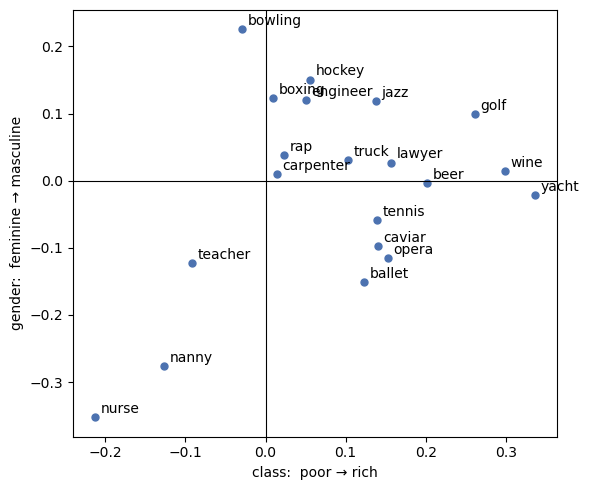

# Overview

This week we survey various computational methods developed in the past decade before genAI took off, including:  

- Topic modeling
- Dependency parsing ("motif extraction")
- Word embeddings
- BERT  

Methods like topic modeling and the rule-based dependency parsing ("motif extraction) have ready-to-use R packages. Check out resources below if you are interested:

::: {.callout-note}
## R Packages for Topic Modeling & Dependency Parsing
* Structural Topic Modeling: [`stm`](https://CRAN.R-project.org/package=stm)
* Motif Extraction: [`semgram`](https://CRAN.R-project.org/package=semgram). Also check out [spaCy](https://spacy.io/), a Python NLP library that does dependency parsing, named entities recognition, and other NLP tasks.
:::

Our lab today focuses on word embeddings and BERT, as well as generating and evaluating classification metrics, all run in Python. Preview:

0. Set Up
1. Word embeddings — including the Kozlowski et al. (2019) projection method
2. BERT - including fine-tuning and evaluation metrics

---

# 0. Setup

**Step 1: Activate the virtual environment**

Open Terminal or your CLI, navigate to the directory containing your `aisocsci-env` virtual environment, and activate it. Then, install this week's packages in the virtual environment.

```bash
# Use cd path/to/your/env if you are not in the same directory as your virtual environment
source ~/aisocsci-env/bin/activate        # macOS/Linux
# ~/aisocsci-env\Scripts\activate          # Windows

# Install packages in the virtual environment
pip install gensim transformers torch datasets accelerate

```

**Step 2: Launch Jupyter notebook**

Using CLI, navigate to your repo folder and launch Jupyter from there:

```bash
cd /path/to/your/repo # the repo you created in Lab 1
jupyter notebook
```

This opens a **browser tab** showing the files in that folder. Create a new notebook (click **New** → **Python 3**).

::: {.callout-note}
## Tips for using Jupyter notebooks

1. You can organize your content by adding **Markdown cells** (click the "+" button, then change the cell type to "Markdown" in the dropdown menu). Use Markdown to add headings, explanations, and comments.

2. Run a cell by selecting it and pressing **Shift + Enter**, or the "playing" button in the toolbar. You can also run all cells in the notebook by clicking **Cell → Run All**.

3. Add **code cells** by typing "a" or "b", delete cells by typing "dd".

:::

**Step 3: Set up in Jupyter notebook**

In the new Jupyter notebook, paste the following code and run it:

```python
import numpy as np, pandas as pd, matplotlib.pyplot as plt
import sklearn, gensim, torch, transformers

print(f"scikit-learn:  {sklearn.__version__}")
print(f"gensim:        {gensim.__version__}")
print(f"torch:         {torch.__version__}")
print(f"transformers:  {transformers.__version__}")
```
::: {.callout-tip}
## Expected output
```text
scikit-learn:  1.0.2
gensim:        4.1.2
torch:         1.12.1
transformers:  4.23.1
```
:::


---

# 1. Word Embeddings

## 1.1 Loading pretrained vectors

Training good embeddings needs billions of words, so — as in Kozlowski et al. 2019 — we use vectors someone else trained. `gensim` downloads them for us (~130 MB, cached after the first run, it may take a while to load).

```python
import gensim.downloader as api

# This may take a while
glove = api.load("glove-wiki-gigaword-100")    # 400,000 words × 100 dimensions

# Print number of words in the vocab
print(f"vocabulary: {len(glove.index_to_key):,} words")  

# Print number of dimensions for the word 'sociology'
print(f"the vector for 'sociology' has {len(glove['sociology'])} numbers") 

# Show the first 8 numbers of the vector for 'sociology'
print(glove["sociology"][:8].round(3)) 
```

::: {.callout-tip}
## Expected output
```text
vocabulary: 400,000 words
the vector for 'sociology' has 100 numbers
[ 0.461 -0.225 -0.163  0.525  0.944 -0.179  0.59  -0.45 ]
```
:::


Nearest neighbours are the first thing to look at — this is "meaning as company kept":

```python
# Find the 6 words most similar to each of the four words
for w in ["rich", "protest", "immigrant", "family"]:
    print(f"{w:10s} → {', '.join(x for x, _ in glove.most_similar(w, topn=6))}")
```

::: {.callout-tip}
## Expected output
```text
rich       → especially, wealthy, richer, vast, diverse, particularly
protest    → protests, protesting, demonstrations, demonstration, protesters, protested
immigrant  → immigrants, migrant, migrants, immigration, citizen, undocumented
family     → father, mother, friends, parents, families, whose
```
:::


```python
# The famous analogy: king - man + woman ≈ ?
# Print the 3 words most similar to the vector king - man + woman
print(glove.most_similar(positive=["king", "woman"], negative=["man"], topn=3))
```

::: {.callout-tip}
## Expected output
```text
[('queen', 0.7698540687561035), ('monarch', 0.6843380928039551), ('throne', 0.6755736470222473)]
```
:::


## 1.2 Projecting Word Vectors to two Cultural Dimensions: Class & Gender

Kozlowski et al. (2019) constructed cultural dimensions using difference vectors of antonym pairs that represents the two ends of a cultural dimension. 

We replicate this method by looking at two dimensions: Class (`rich – poor`) and Gender (`man – woman`).

We then project a set of words (occupations, sports, arts, etc.) onto these two dimensions and visualize their positions in a 2D space.


- **Step 1**: Define two functions: (1) `make_dimension` to create a cultural dimension from antonym pairs, and (2)  `project` to project a word onto a given dimension (i.e. calculate the **cosine similarity** between the normalized word vector and the dimension vector).

::: {.callout-note collapse="true"}
## Consine Similarity & Angle Between Two Vectors
Cosine similarity is the dot product of two normalized vectors, which is exactly what the `project` function does:

$$
\cos(\theta) \;=\; \frac{\mathbf{a} \cdot \mathbf{b}}{\lVert\mathbf{a}\rVert \; \lVert\mathbf{b}\rVert}
\;=\; \frac{\sum_{i=1}^{n} a_i \, b_i}{\sqrt{\sum_{i=1}^{n} a_i^{2}} \; \sqrt{\sum_{i=1}^{n} b_i^{2}}}
$$

- **Numerator**: dot product of two word vectors
- **Denominator**: the product of the two vectors' lengths.
- **Range**: −1 (opposite) to +1 (same direction); 0 means perpendicular / unrelated.

The angle is the `arccosine` of that value:
$$
\theta \;=\; \arccos\!\left(\frac{\mathbf{a} \cdot \mathbf{b}}{\lVert\mathbf{a}\rVert \; \lVert\mathbf{b}\rVert}\right)
$$
:::

```python
def make_dimension(pairs):
    """Average the difference vectors of several antonym pairs → one direction."""
    diffs = []
    for a, b in pairs:
        # for each antonym pair, normalize the vectors and calculate the difference
        va = glove[a] / np.linalg.norm(glove[a]) # normalizes the vector for word a
        vb = glove[b] / np.linalg.norm(glove[b]) # normalizes the vector for word b
        diffs.append(va - vb) # calculates the difference vector for the pair
    d = np.mean(diffs, axis=0) # average the difference vectors 
    return d / np.linalg.norm(d) # normalizes the average difference vector to get the final dimension

def project(word, dimension):
    """Cosine similarity of a normalized word vector with the dimension."""
    v = glove[word] / np.linalg.norm(glove[word]) 
    return float(v @ dimension)

```

- **Step 2**: Define the two dimensions and a list of words to project.
```python
class_dim  = make_dimension([("rich", "poor"), ("wealthy", "impoverished"),
                             ("affluent", "needy"), ("luxury", "cheap")])
gender_dim = make_dimension([("man", "woman"), ("he", "she"),
                             ("his", "her"), ("male", "female")])

items = ["nurse", "nanny", "teacher", "carpenter", "engineer", "lawyer",
         "golf", "tennis", "boxing", "bowling", "hockey",
         "opera", "ballet", "jazz", "rap", "caviar", "beer", "wine", "yacht", "truck"]
```

You can try the functions we created on indivdiual words:

```python
# You can try individual calculation:
project("nurse", class_dim)
project("nurse", gender_dim)
```

**Step 3**: Project all words onto the two dimensions and create a DataFrame for visualization.
```python
proj = pd.DataFrame({
    "class":  [project(w, class_dim)  for w in items],
    "gender": [project(w, gender_dim) for w in items],
}, index=items)

# Print the projected values rounded to 3 decimal places and sorted by class (poor → rich)
print(proj.sort_values("class").round(3))
```
You should see `nurse`, `nanny`, `teacher` at the poor end and `yacht`, `wine`, `golf` at the rich end; on the gender dimension `nurse` and `nanny` sit far on the feminine side, `hockey` and `engineer` on the masculine side.

::: {.callout-tip collapse="true"}
## Expected output
```text
           class  gender
nurse     -0.213  -0.352
nanny     -0.127  -0.276
teacher   -0.092  -0.123
bowling   -0.029   0.225
boxing     0.009   0.123
carpenter  0.014   0.010
rap        0.023   0.039
engineer   0.050   0.120
hockey     0.056   0.150
truck      0.103   0.031
ballet     0.123  -0.150
jazz       0.137   0.118
tennis     0.139  -0.058
caviar     0.140  -0.097
opera      0.153  -0.115
lawyer     0.157   0.027
beer       0.202  -0.003
golf       0.262   0.099
wine       0.299   0.014
yacht      0.336  -0.022
```
:::


```python
# Visualize the projected words in a scatter plot
fig, ax = plt.subplots(figsize=(6, 5))
ax.axhline(0, color="black", lw=0.8); ax.axvline(0, color="black", lw=0.8)
ax.scatter(proj["class"], proj["gender"], s=25, color="#4C72B0")
for w, row in proj.iterrows():
    ax.annotate(w, (row["class"], row["gender"]), fontsize=10,
                textcoords="offset points", xytext=(4, 3))
ax.set_xlabel("class:  poor → rich")
ax.set_ylabel("gender:  feminine → masculine")
plt.tight_layout(); plt.show()
```

::: {.callout-tip collapse="true"}
## Expected output

{width="400px"}

:::


## 1.3 The angle between two dimensions

Kozlowski et al.'s central historical finding is about how the *dimensions* relate to each other over time. The measure is the cosine of the angle between them. 


```python
cos = float(class_dim @ gender_dim) #calculate cosine similarity between class and gender dimensions
print(f"cosine between class and gender dimensions: {cos:.3f}") #print the cosine similarity rounded to 3 decimal places

angle = np.degrees(np.arccos(cos)) #calculate the angle in degrees between the two dimensions
print(f"angle: {angle:.1f}°") #print the angle rounded to 1 decimal place
```

::: {.callout-tip}
## Expected output
```text
cosine between class and gender dimensions: 0.040
angle: 87.7°
```
:::


::: {.callout-tip}
## Practice on your own (Optional)
1. Build an **education** dimension (`educated – uneducated`, `learned – ignorant`, …) and project the same items. Is education aligned with affluence in these vectors? 
2. Add words from your own research area and check whether their positions match your expectation. Where the model is *wrong*, why is it wrong?
:::

::: {.callout-warning}
## Two limits of this method
1. **A word has exactly one vector.** `bank` in *river bank* and *investment bank* is the same 100 numbers, and `not free` is just `not` plus `free`. Section 2 fixes this: BERT gives a word a *different* vector in every sentence it appears in.
2. **Association is not action.** The projection tells us `nurse` sits on the feminine side of a gender dimension, but it cannot tell us what types of actions nurses take, and what kind of treatment they get. For those questions, Stuhler's (2022) motif extraction methods can provide more insights.
:::

---

# 2. Pretrained Transformers: BERT

## 2.1 Where BERT differs from Word Embeddings

::: {.callout-important}
## From non-contextual to contextual embeddings
Word embedding models in Section 1 gave every word **one fixed vector**, learned from the company it keeps across a whole corpus. BERT is the next generation of the same idea, with two changes that matter for research:

1. **Context.** BERT reads the whole sentence, so `bank` gets a different vector in *river bank* than in *investment bank*, and `not free` is not just `not` plus `free`.
2. **Transfer.** BERT was pretrained on a very large amount of text by filling in masked-out words. You start from what it already knows from pretraining, so you need far fewer labels of your own to fine-tune the model for your research task.

:::

```python
import torch
from transformers import AutoTokenizer, AutoModel

MODEL = "distilbert-base-uncased"      # a smaller, faster BERT
tok   = AutoTokenizer.from_pretrained(MODEL)
bert  = AutoModel.from_pretrained(MODEL).eval()

# sentences are tokenized into subword pieces
print(tok.tokenize("Rhetorics of radicalism in unedited newsgroup prose"))
```

::: {.callout-tip}
## Expected output
```text
['rhetoric', '##s', 'of', 'radical', '##ism', 'in', 'une', '##dit', '##ed', 'news', '##group', 'prose']
```
:::


Note what the tokenizer did to "rhetorics" and "unedited" — BERT works on **subword pieces**, which is how it copes with words it has never seen. 

Now we check how **the same word (token) gets a different vector depending on the context**. The word "bank" appears in three different sentences, and we will compare the vectors BERT gives it in each context:

```python
def word_vector(sentence, word):
    """The contextual vector BERT gives one word inside one sentence."""
    batch = tok(sentence, return_tensors="pt")
    with torch.no_grad():
        hidden = bert(**batch).last_hidden_state[0]        # tokens × 768
    pieces = tok.convert_ids_to_tokens(batch["input_ids"][0])
    rows   = [i for i, pc in enumerate(pieces) if pc == word]
    return hidden[rows].mean(0).numpy()

def cosine(a, b):
    return float(a @ b / (np.linalg.norm(a) * np.linalg.norm(b)))

# Get the contextualized embeddings for "bank" in three different sentences
river  = word_vector("We sat on the river bank and watched the water.", "bank")
money  = word_vector("She went to the bank to deposit her paycheck.",   "bank")
loan   = word_vector("The bank approved the mortgage loan yesterday.",  "bank")

# Compare the three vectors with cosine similarity
print(f"bank (river) vs bank (deposit): {cosine(river, money):.3f}")
print(f"bank (deposit) vs bank (loan):  {cosine(money, loan):.3f}")
```

::: {.callout-tip}
## Expected output
```text
bank (river) vs bank (deposit): 0.679
bank (deposit) vs bank (loan):  0.894
```
:::


## 2.2 Using BERT for classification: Preparing a labeled dataset

Now we use BERT to classify documents. The first step is to get a labeled dataset. We use the **20 Newsgroups** corpus. It is a collection of Usenet posts from 1993–94, labelled by the discussion group they were posted to. For simplicity, we keep only four groups: two political, one religious, one scientific. **The task is to classify whether a post is about religion or not.**

```python
from sklearn.datasets import fetch_20newsgroups

# a list of groups to keep
CATS = ["talk.politics.guns", "talk.politics.mideast",
        "talk.religion.misc", "sci.space"]

# create the corpus, keeping only the specified groups, removing headers, footers, and quoted replies
news = fetch_20newsgroups(subset="all", categories=CATS,
                          remove=("headers", "footers", "quotes"),
                          shuffle=True, random_state=42)

# Drop very short posts (one-line replies carry no signal)
docs   = [d for d in news.data if len(d.split()) >= 20]

# Create a label/outcome array: 1 if the post is about religion, 0 otherwise
labels = [news.target[i] for i, d in enumerate(news.data) if len(d.split()) >= 20]

print(f"{len(docs)} documents in {len(news.target_names)} groups")
print(news.target_names)
print("\n--- one example ---\n")
print(docs[0][:400])
```

::: {.callout-tip}
## Expected output
```text
3101 documents in 4 groups
['sci.space', 'talk.politics.guns', 'talk.politics.mideast', 'talk.religion.misc']

--- one example ---

'Alone'? Sorry, but the following western scholars are forced to disagree
with you. During the First World War and the ensuing years - 1914-1920,
the Armenians through a premeditated and systematic genocide, ...
```
:::


**The task:** *is this post about religion?* The `talk.religion.misc` label is our ground truth.

For classification, we **split the data into a training set (70%) and a test set (30%)**. The test set is held out until the very end, so that we can evaluate the model's performance on unseen data.

```python
# The train_test_split function randomly splits the data into training and test sets
from sklearn.model_selection import train_test_split

# Define the positive class (religion) as 1, and the negative class (non-religion) as 0
y = np.array([1 if news.target_names[l] == "talk.religion.misc" else 0 for l in labels])

# Print the proportion of positive class in the dataset: imbalanced, like most real tasks
print(f"positive class: {y.mean():.1%} of documents") 


# Split the data into training and test sets, stratifying by the label to maintain class balance
i_train, i_test = train_test_split(np.arange(len(docs)), test_size=0.3,
                                   random_state=42, stratify=y)
print(f"train: {len(i_train)}   test: {len(i_test)}")
```

::: {.callout-tip}
## Expected output
```text
positive class: 17.4% of documents
train: 2170   test: 931
```
:::


::: {.callout-important}
## The rule about test sets
The test set is touched **once**, at the end. Every modeling choice (vectorizer settings, model, threshold) is made using training data only. Otherwise your reported performance is a description of your own tuning, not of the model.
:::

## 2.3 A baseline classification model: word counts (tf-idf)

Before reaching for BERT, we fit a fast, simple classification model based on **tf-idf**.   

**tf-idf** turns each document into a row of word weights: how often a word appears *in this document*, times how rare it is *across documents*. Words that appear everywhere get almost no weight.

```python
from sklearn.feature_extraction.text import TfidfVectorizer
from sklearn.linear_model import LogisticRegression

# Create a tf-idf vectorizer with some filtering: 
#   ignore English stop words, 
#   keep only words that appear in at least 3 documents and in at most 60% of documents, 
#   consider unigrams and bigrams. 
#   Use sublinear tf scaling (1 + log(tf)) to reduce the impact of very frequent terms.
vec = TfidfVectorizer(stop_words="english", min_df=3, max_df=0.6,
                      ngram_range=(1, 2), sublinear_tf=True)

# Fit the vectorizer on the training documents and transform both training and test into tf-idf matrices
X_train = vec.fit_transform([docs[i] for i in i_train])
X_test  = vec.transform([docs[i] for i in i_test])

# Fit a logistic regression model on the training data and predict probabilities on the test data
clf_tfidf = LogisticRegression(max_iter=2000).fit(X_train, y[i_train])
p_tfidf   = clf_tfidf.predict_proba(X_test)[:, 1]   

# Print the first 8 predicted probabilities rounded to 3 decimal places
print(p_tfidf[:8].round(3))
```

::: {.callout-tip}
## Expected output
```text
[0.219 0.159 0.133 0.115 0.093 0.156 0.177 0.076]
```
:::

An advantage of the tf-idf method is that you can interpret the results: you can see which words are most indicative of each class. BERT, in contrast, is more like a "black box."

```python
# identify the 12 words most indicative of the positive class (religion) and the 12 least indicative
feat  = np.array(vec.get_feature_names_out())

# Get the indices that would sort the coefficients of the logistic regression model
order = clf_tfidf.coef_[0].argsort()

# Print the 12 most indicative words for the positive class and the 12 least indicative words
print("most 'religion':", ", ".join(feat[order[::-1][:12]]))
print("least 'religion':", ", ".join(feat[order[:12]]))
```

::: {.callout-tip}
## Expected output
```text
most 'religion': god, jesus, christian, kent, bible, cheers kent, cheers, objective, evidence, koresh, religion, christians
least 'religion': space, israel, gun, arab, israeli, year, nasa, orbit, control, government, rights, arabs
```
:::


## 2.4 BERT as a feature extractor

The cheap and surprisingly strong way to use BERT is to let it convert each document into one vector, then fit the *same* logistic regression on those vectors. Nothing of the BERT model is modified — hence it is "frozen."

```python
# a function to convert a list of texts into BERT embeddings
def embed(texts, batch_size=16, max_length=128):
    """Mean-pool BERT's last layer → one 768-number vector per document."""
    out = []
    with torch.no_grad():
        for i in range(0, len(texts), batch_size):
            batch = tok(texts[i:i+batch_size], padding=True, truncation=True,
                        max_length=max_length, return_tensors="pt")
            hidden = bert(**batch).last_hidden_state           # tokens × 768
            mask   = batch["attention_mask"].unsqueeze(-1).float()
            out.append(((hidden * mask).sum(1) / mask.sum(1)).numpy())
    return np.vstack(out)

# embed the first 2000 characters of each document to get a 768-dimensional vector for each document
E = embed([d[:2000] for d in docs])    

# print the shape of the resulting embedding matrix
print(f"BERT features: {E.shape}")
```

::: {.callout-tip}
## Expected output
```text
BERT features: (3101, 768)
```
:::


::: {.callout-warning}
## `max_length=128` is a measurement decision that you can change
BERT reads at most 512 tokens and we cut at 128 to keep it fast, so **long posts are truncated**. That is a measurement decision, not a technicality. If the relevant token shows up late in a document, this pipeline will miss it. THis means we compromises between speed and accuracy. You can experiment with longer truncation lengths, but the time cost rises quickly.
:::

```python

# Fit a logistic regression model on the BERT embeddings and predict probabilities on the test set
clf_bert = LogisticRegression(max_iter=3000).fit(E[i_train], y[i_train])

# Predict probabilities for the positive class (religion) on the test set
p_bert   = clf_bert.predict_proba(E[i_test])[:, 1]

# print the first 8 predicted probabilities rounded to 3 decimal places
print(p_bert[:8].round(3))
```

::: {.callout-tip}
## Expected output
```text
[0.44  0.043 0.21  0.027 0.012 0.002 0.041 0.008]
```
:::


Both models are now scored on **the same 931 held-out documents**, so Section 3 can compare them directly.

## 2.5 Fine-tuning

Fine-tuning updates BERT's own weights on your training data. This is what Lai et al. (2024) did. On the machine this lab was tested on (8-core laptop CPU, no GPU) one epoch over 400 documents truncated to 128 tokens took **about 25 seconds**. The cost climbs fast with more documents, longer texts, and more epochs.

```python
from datasets import Dataset
from transformers import (AutoModelForSequenceClassification, TrainingArguments,
                          Trainer, DataCollatorWithPadding)

train_i, test_i = i_train[:400], i_test[:150]

def to_dataset(idxs):
    d = Dataset.from_dict({"text":  [docs[i][:2000] for i in idxs],
                           "label": [int(y[i]) for i in idxs]})
    return d.map(lambda b: tok(b["text"], truncation=True, max_length=128), batched=True)

model = AutoModelForSequenceClassification.from_pretrained(MODEL, num_labels=2)
args  = TrainingArguments(output_dir="./bert_out", num_train_epochs=1,
                          per_device_train_batch_size=8, per_device_eval_batch_size=16,
                          learning_rate=5e-5, logging_steps=25,
                          save_strategy="no", eval_strategy="no",
                          report_to=[], use_cpu=True)

trainer = Trainer(model=model, args=args,
                  train_dataset=to_dataset(train_i), eval_dataset=to_dataset(test_i),
                  data_collator=DataCollatorWithPadding(tok))   # pads each batch to equal length
trainer.train()

logits = trainer.predict(to_dataset(test_i)).predictions
p_ft   = np.exp(logits[:, 1]) / np.exp(logits).sum(1)
print(p_ft[:8].round(3))
```

::: {.callout-tip}
## Expected output
```text
{'loss': '0.4169', 'grad_norm': '1.6', 'learning_rate': '2.6e-05', 'epoch': '0.5'}
{'loss': '0.3849', 'grad_norm': '3.364', 'learning_rate': '1e-06', 'epoch': '1'}
{'train_runtime': '22.07', 'train_samples_per_second': '18.12', 'train_loss': '0.4009', 'epoch': '1'}
[0.051 0.06  0.063 0.049 0.047 0.054 0.054 0.035]
```
:::


::: {.callout-note}
## Thinking about the labeling burden
Fine-tuning 400 examples takes under a minute; hand-labeling 400 documents takes hours. Where is the real bottleneck in a project like Lai et al.'s. Thinking about ways to reduce the labeling burden is a key part of designing a research project.
:::


## 2.6. Evaluating Model Performance

This week we only focus on looking at the most basic metrics: **accuracy, precision, recall, F1, ROC-AUC, PR-AUC**. We will talk about their meanings and trade-offs next week.

The confusion matrix and the metrics built from it:

```python
from sklearn.metrics import (confusion_matrix, accuracy_score, precision_score,
                             recall_score, f1_score, roc_auc_score,
                             average_precision_score, roc_curve, precision_recall_curve)

y_test = y[i_test]

def report(y_true, scores, threshold=0.5, name=""):
    pred = (scores >= threshold).astype(int)
    tn, fp, fn, tp = confusion_matrix(y_true, pred).ravel()
    print(f"--- {name} (threshold = {threshold}) ---")
    print(f"true positives  {tp:4d}    false positives {fp:4d}")
    print(f"false negatives {fn:4d}    true negatives  {tn:4d}")
    print(f"accuracy  {accuracy_score(y_true, pred):.3f}"
          f"   precision {precision_score(y_true, pred, zero_division=0):.3f}"
          f"   recall {recall_score(y_true, pred):.3f}"
          f"   F1 {f1_score(y_true, pred):.3f}")
    print(f"ROC-AUC   {roc_auc_score(y_true, scores):.3f}"
          f"   PR-AUC {average_precision_score(y_true, scores):.3f}\n")

# tf-idf and frozen BERT were both scored on all 931 test documents
report(y_test, p_tfidf, 0.5, "tf-idf + logistic regression")
report(y_test, p_bert,  0.5, "frozen BERT + logistic regression")

# The fine-tuned model was evaluated on only 150 documents (test_i = i_test[:150]),
# so we score it on those same 150 for a fair, apples-to-apples comparison.
y_ft_test = y[test_i]
report(y_ft_test, p_ft, 0.5, "fine-tuned BERT @ threshold 0.5")
```

::: {.callout-tip}
## Expected output
```text
--- tf-idf + logistic regression (threshold = 0.5) ---
true positives    49    false positives    0
false negatives  113    true negatives   769
accuracy  0.879   precision 1.000   recall 0.302   F1 0.464
ROC-AUC   0.963   PR-AUC 0.892

--- frozen BERT + logistic regression (threshold = 0.5) ---
true positives   119    false positives   17
false negatives   43    true negatives   752
accuracy  0.936   precision 0.875   recall 0.735   F1 0.799
ROC-AUC   0.953   PR-AUC 0.877

--- fine-tuned BERT @ threshold 0.5 (threshold = 0.5) ---
true positives     0    false positives    0
false negatives   18    true negatives   132
accuracy  0.880   precision 0.000   recall 0.000   F1 0.000
ROC-AUC   0.861   PR-AUC 0.675
```
*(The fine-tune numbers will vary somewhat between runs — training is stochastic — but the pattern of high AUC with F1 = 0 at threshold 0.5 is stable.)*
:::

**Something strange happened with the fine-tuned model**: its ROC-AUC (~0.86) is high but at threshold 0.5 it caught **zero** positives — precision, recall, and F1 are all 0. Look back at the fine-tune scores in Section 2.5: every score is below 0.5. Fine-tuning on only 400 documents produced a model that **ranks documents in the right order** (that's what ROC-AUC measures) but assigns everything a low probability — so the default 0.5 threshold flags nothing.

The `>= 0.5` cutoff is a choice, not a law. Since we know 17% of the corpus is about religion, we can pick the threshold that flags the top 17% of scores:

```python
# Pick a threshold that flags the top ~17% of predicted scores (matching the true base rate)
thr_ft = float(np.quantile(p_ft, 1 - y_ft_test.mean()))
print(f"score distribution: min={p_ft.min():.3f}  max={p_ft.max():.3f}  "
      f"share above 0.5: {(p_ft >= 0.5).mean():.1%}")
print(f"calibrated threshold: {thr_ft:.3f}\n")

report(y_ft_test, p_ft, thr_ft, "fine-tuned BERT (calibrated threshold)")
```

::: {.callout-tip}
## Expected output
```text
score distribution: min=0.033  max=0.271  share above 0.5: 0.0%
calibrated threshold: 0.098

--- fine-tuned BERT (calibrated threshold) (threshold = 0.09775356680154804) ---
true positives    11    false positives    7
false negatives    7    true negatives   125
accuracy  0.907   precision 0.611   recall 0.611   F1 0.611
ROC-AUC   0.861   PR-AUC 0.675
```
*(Fine-tune numbers vary run to run — training is stochastic. What stays stable is the pattern: ROC-AUC is high, F1 at threshold 0.5 is near zero, and picking a threshold from the score distribution recovers most of the model's real quality.)*
:::

---


# Submitting your lab

First, commit your changes to your local git repo, then push them to GitHub:
```bash
git add .
git commit -m "Complete lab 2"
git push origin main
```

Then **submit your repo link on the [course form](https://docs.google.com/spreadsheets/d/1m3iRIgdCrZlePTTitDpsGe6I_jEPtDwF4oFMeNix2uw/edit?usp=sharing)**.
