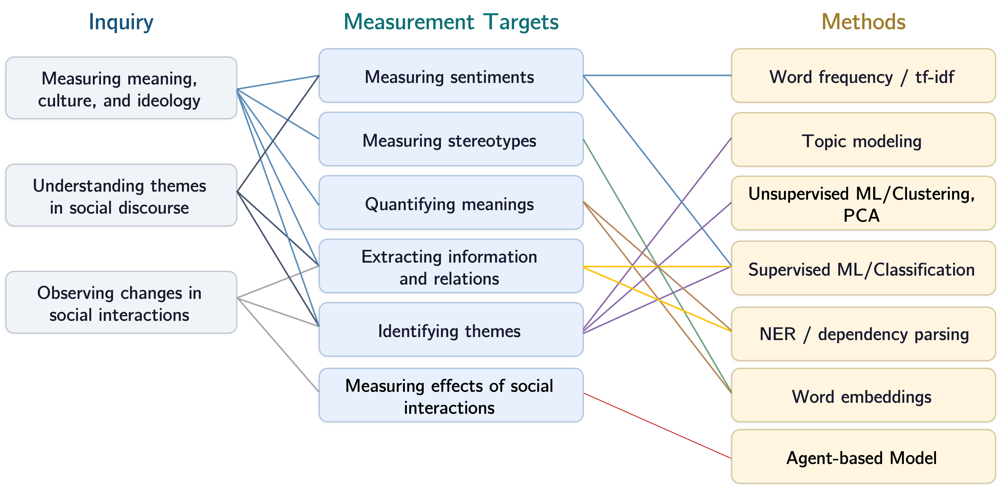
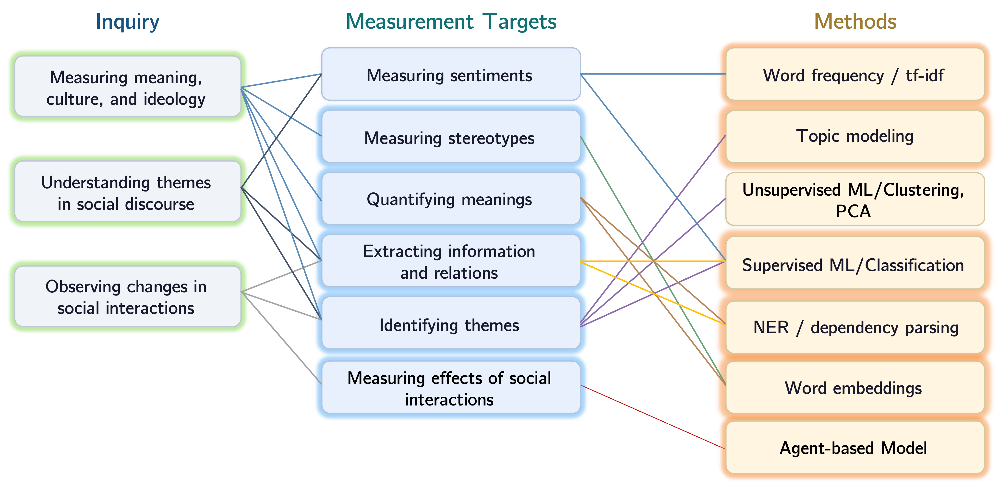
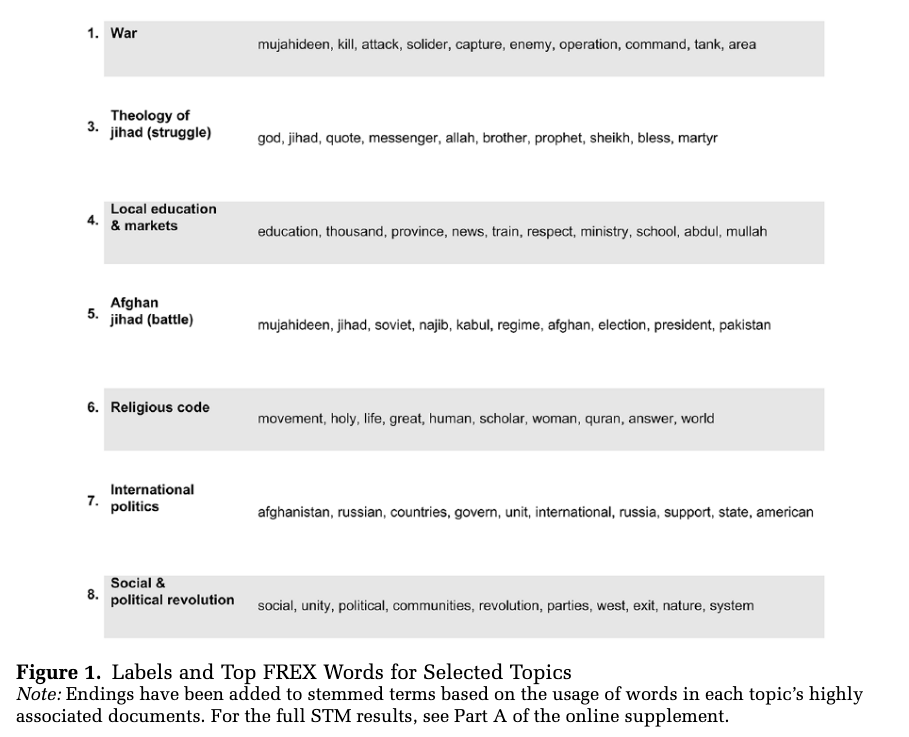
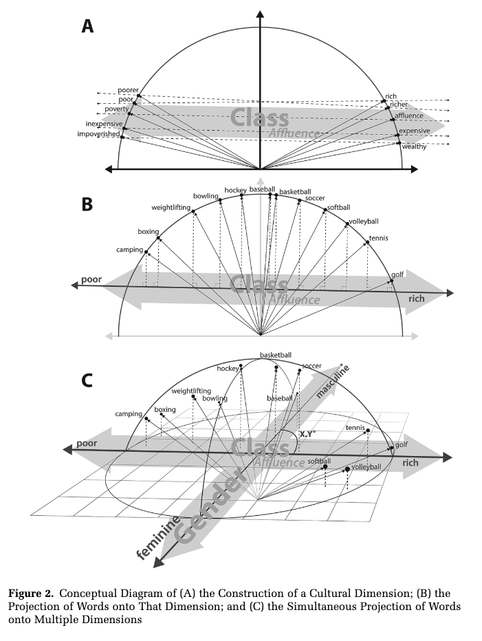
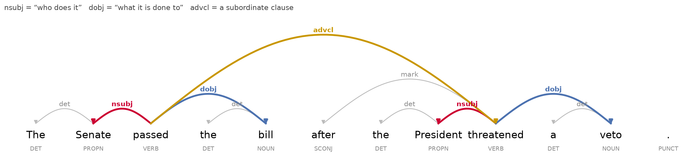
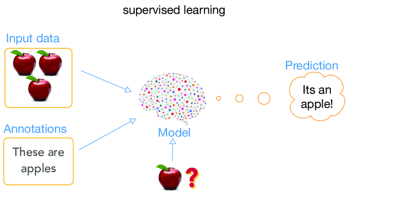
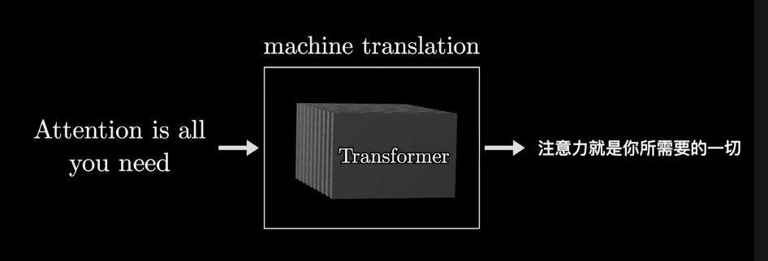
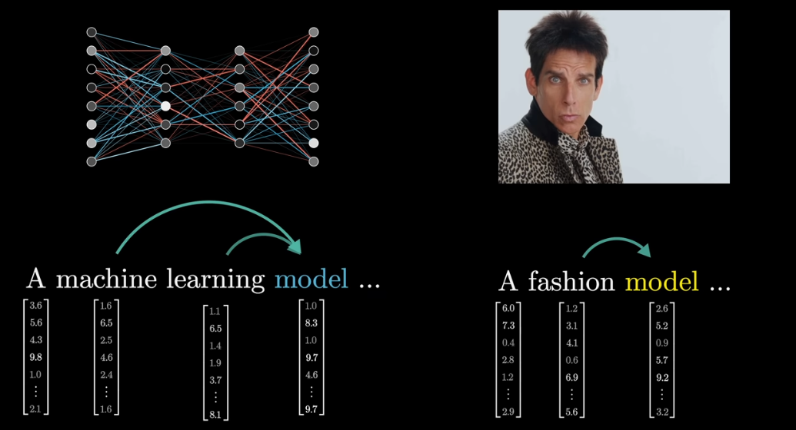
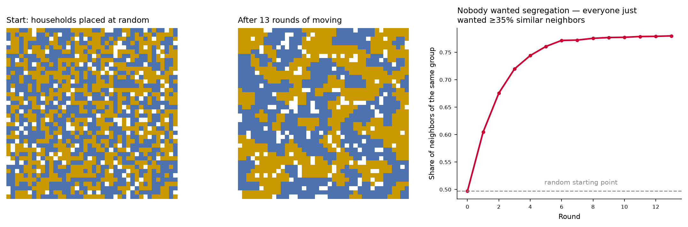
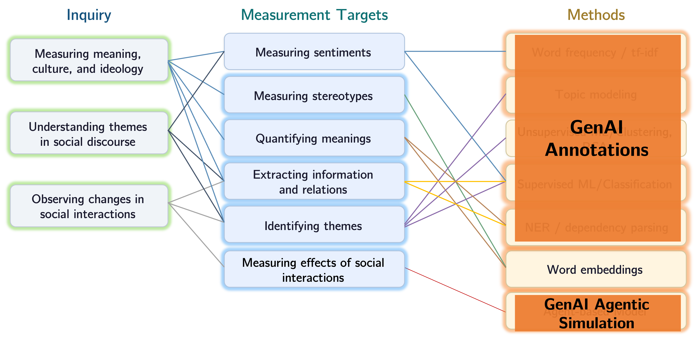

## Plan of Today

- **Lecture & Discussion: Methods before genAI Part 1** ~50 min — Word Frequency, Topic Models, Word Embeddings
- **Break**: 10 min
- **Lecture & Discussion: Methods before genAI Part 2** ~40 min — Dependency Parsing, BERT & Transformers, Agent-based Models
- **Lab** ~60 min — Word-embedding and BERT in Python

## Logistics

Reading Presentations Start Next Week!

20~30 min presentation, 10~15 min discussion. Using "guiding questions" on the syllabus as a starting point.

| Week | Topic | Date | Group |
|------|-------|------|-------|
| 3 | Text, Image & Video Annotation | Sep. 16 | Zakaria, Seukyoung, Daye|
| 4 | Simulating Subjects & Agents | Sep. 23 | Woojung, YJ |
| 5 | AutoResearch | Sep. 30 | Duhui, Chun-Ching, Yujia |
| 6 | Qualitative Research | Oct. 7 | Beichen, Jayla |

## Where We Left Off Last Week: Methods before GenAI

## This Week's Readings

::: {style="font-size: 0.85em;"}

| Reading | Measure Targets, Methods |
|---|----|
| Karell & Freedman (2019), *Rhetorics of Radicalism* | Identifying themes, **topic modeling** |
| Kozlowski, Taddy & Evans (2019), *Geometry of Culture* | Quantifying meanings & measuring stereotypes, **word embeddings** |
| Stuhler (2022), *Who Does What to Whom* | Extracting information & relations, **dependency parsing** |
| Lai et al. (2024), *Ideology of YouTube Videos* | Quantifying meaning (ideologies), **BERT Classification** |

:::

## This Week's Lecture: 

# 1. Word Frequency and tf-idf  {.center background-color="#CC0033"}

## Word Frequency and tf-idf: Definition & Use 

:::: {.columns}
::: {.column width="50%"}
   ](images/tf-idf.png){ width=100%}
:::

::: {.column width="50%"} 

::: {style="font-size: 0.9em;"}
::: {.incremental}
- A method to identify **distinctive** words in a corpus.  
- **tf-idf** = how often a word appears *in this document* (**t**erm **f**requency) × how rare it is *across documents* (**i**nverse **d**ocument **f**requency).
- **Good for:** identifying keywords or distictive words, a baseline for classification.
-   **Blind to:** word order, negation ("not free" vs. "free"), context, meaning, and relations between words.
:::
:::

:::

::::

## 1. Word Frequency and tf-idf: Mathematical Definition

:::: {.columns}
::: {.column width="50%"}
   ](images/tf-idf.png){width="100%"}
:::

::: {.column width="50%"}

](images/tf-idf-formula.png){width="100%"}
:::

::::

# 2. Topic Modeling  {.center background-color="#CC0033"}

## Topic Modeling: Key Idea
::: {style="font-size: 0.85em;"}
- Every document is seen as a *mixture* of a set of "topics."  
- Every topic is seen as a *weighted word list*.  
- The model jointly estimates document-topic and topic-word distributions from co-occurrence patterns across the whole corpus.
:::
](images/topic-modeling.webp)

## Topic Modeling: An Unsupervised Approach

:::: {.columns}

::: {.column width="40%"}
::: {style="font-size: 0.9em;"}
::: {.incremental}
- You provide the corpus & the number of topics *K*.
- The algorithm returns the topics and the topic mixture for each document.
- You read the topics and name them.
- There's **no "right" number of *K***: Researchers make judgements based on **interpretability, stability, and gains in theoretical insights**.
- Outcomes of topic modeling (e.g. prevelance of topics, topic ratios) can be used as **variables for downstream analysis**.
:::
:::
:::

::: {.column width="60%"}

:::

::::

## Two Kinds of Topic Models: LDA vs. STM
::: {style="font-size: 0.85em;"}
- **LDA** (Latent Dirichlet Allocation): treats documents as exchangeable — no covariates.
- **STM** (Structural Topic Model): uses document metadata as **covariates** (e.g., year, source) in up to two places:
     - Topical prevalence: covariates shift the Dirichlet prior on a document's topic proportions, so **topics can be systematically more/less prevalent by group**.
     - Topical content: covariates can shift the word distribution within a topic, so the **same topic can be "expressed" with different vocabulary by group**
:::
](images/lda_vs_stm.png)

# 3. Word Embeddings  {.center background-color="#CC0033"}

## Word Embeddings: The Geometry of Semantic Meaning

Each word is converted into a **vector in a high-dimensional space**, with interesting properties: 

. . .

::: {style="font-size: 0.85em;"}
1. Words with similar meanings are **close together** in the vector space.
:::

. . .

](images/word_embedding_illu1.png){width=50%}

## Word Embeddings: The Geometry of Semantic Meaning

::: {style="font-size: 0.85em;"}
2. Word embeddings can capture **analogies**:  
     - Embedding ("men") - Embedding("women") + Embedding("queen") ≈ Embedding("king") 
     - **Geometric relationships** between word vectors embody **semantic connections**: gender, verb tense, and country-to-capital relations
:::

](images/word_embedding_illu.png)

## The Geometry of Culture (Kozlowski et al. 2019)

:::: {.columns}

::: {.column width="65%"}
::: {style="font-size: 0.9em;"}
::: {.incremental}
- Word embeddings "encodes" **"collective undertanding"** of cultural concepts (words)
- **(Re)construct cultural dimensions from word embedding**: 
     1. Identify concept pairs, 
     2. Compute the average difference vector, 
     3. Project other words onto that dimension.

- We can identify: 
     1. Cultural dimension-specific meaning of a word along multiple cultural dimensions, and how they change over time;
     2. How relationships between cultural dimensions change over time.
:::
:::
:::

::: {.column width="35%"}
::: {style="font-size: 0.9em;"}
{width=95%}
:::
:::

::::

## Word Embeddings: Some Technical Points

::: {.incremental}
1. Word embeddings can be trained using various algorithms, including word2vec, GloVe, and fastText.
2. Basically, the models are trained to predict words from their neighbors, or neighbors from the word, and some methods also use co-occurrence patterns.
3. Traditional word embeddings are **static**: each word has a single vector, regardless of context. Newer models (BERT, GPT) produce **contextualized embeddings**: the vector for a word depends on the sentence it appears in using attention mechanisms, enabled by transformer architectures.
4. The concept of word embedding are important for understanding the innerwork of **LLMs** (Large Language Models). LLMs **use embeddings to represent tokens** in a high-dimensional space, which are then processed by LLMs to generate predictions or outputs.
:::

# Break {.center background-color="#6B8F7B"}

- Come back in 10 minutes

# 4. NER and Dependency Parsing  {.center background-color="#CC0033"}

## NER and Dependency Parsing

Instead of treating a sentence as a **bag of words**, use its **grammar** to recover "**event structure of texts**" (who did what to whom?).

::: {style="font-size: 0.85em;"}
::: {.incremental}
- **Named entity recognition (NER)**: tag the spans of text that are people, organizations, places, dates, money. ("*Los Angeles*" → place; "*Tuesday*" → date.)
- **Dependency parsing**: label the grammatical link between every pair of words — which noun is the *subject* of which verb, which noun is its *object*.
- **Motif extraction**: combine NER and dependency parsing to extract the **actions, treatments, agents, patients, characterizations, and possessions** of an entity of interest (Stuhler 2022).
:::
:::

. . .

# 5. Supervised Machine Learning and Pretained Transformers  {.center background-color="#CC0033"}

## Supervised Machine Learning: Overview

:::: {.columns}

::: {.column width="50%"}
::: {style="font-size: 0.9em;"}
::: {.incremental}
- Train a model to **predict a label from features** based on hand-coded/already-labelled training data.
- Various supervised ML algorithms: 
     1. Linear regression,
     2. Logistic regression,
     3. Naive Bayes,
     4. Random forest, 
     5. Support vector machine, 
     6. Neural networks, such as **fine-tuned transformers (BERT, GPT, etc.)**
:::
:::
:::

::: {.column width="50%"}

{width=100%}

::: {style="text-align: center; font-size: 0.7em;"}
Source: [Devopedia](https://devopedia.org/supervised-learning)
:::
:::

::::

## BERT and GPT: Pretrained Transformers

{width=100%}

::: {.incremental}
- **Transformers** are a type of **neural network architecture** that has become the foundation for LLMs and genAI. They are particularly effective at capturing **long-range contextual information**.

- **Attention mechanisms** are a key component of transformers. They allow the model to **weigh the importance** of different pieces of the input information when making predictions.

- Different genAI models contain billions to hundreds of billions of parameters (weights) that fill in a fixed transformer architecture. These weights are learned during the **pretraining** phase on **large corpora of training data**.
:::

## BERT and GPT: Pretrained Transformers - How They Work in Plain English

:::: {.columns}

::: {.column width="50%"}

{width=100%}

::: {style="text-align: center; font-size: 0.7em;"}
Source: [3Blue1Brown](https://youtu.be/wjZofJX0v4M?si=oONlYPA31WM5DVez)
:::
:::

::: {.column width="50%"}
::: {style="font-size: 0.9em;"}
::: {.incremental}
- For an input vector, a transformer computes a **contextualized embedding** for each token in the input sequence. → This step "understands" the meaning of each token in the context it appears in. 

- This "taking into account the context" step is done by **attention**: each token's embedding is reshaped by other tokens in its context, and their weights (importance) are determined by the attention mechanism (via its Query, Key, and Value matrices).
:::

. . .

::: {.callout-note}
# BERT looks at both preceding and following tokens, while GPT models only look at preceding tokens.
:::

:::
:::

::::

## Applying BERT for Classification

:::: {.columns}

::: {.column width="45%"}
](images/pretrain_vs_ft.png){width=100%}
:::

::: {.column width="55%"}
**Two ways to use BERT for Supervised ML/Classification:**

1. **As a feature extractor**: pre-trained BERT, use its output vectors as inputs to a plain logistic regression. 
2. **Fine-tuning**: keep training BERT's own weights on your own labeled dataset. Better, slower, needs more tuning.

::: {.callout-tip}
## Both are in today's lab codes.
:::
:::
::::

# 6. Agent-Based Models {.center background-color="#CC0033"}

## Agent-Based Models (ABMs)
::: {style="font-size: 0.8em;"}
Key idea: Specify simple rules for individual behavior, run the interaction forward, and see what pattern emerges at the population level.
:::
. . .

::: {style="font-size: 0.8em;"}
- ABMs are used to study the **effects of social interaction**. 
- ABMs **do not use text as data**.
- ABMs are **not machine learning**: they are simulations, not predictive models.
- Two classic examples: [Schelling's](https://www.tandfonline.com/doi/abs/10.1080/0022250X.1971.9989794) segregation model (1971) and [Axelrod's](https://journals.sagepub.com/doi/abs/10.1177/0022002797041002001?casa_token=a8-elcXQctwAAAAA:egbbLQ-ZwKFi3PYZkOLxQBxpCHQbbBwaBvdArk2vFV_nV83J_bgAhb78jOOpptBK4mS_YBywKo8t) dissemination of culture (1997).
:::

. . .

{width=70%}

# Review

## Today We Covered:

::: {style="font-size: 0.6em;"}
- Note how empirical computational research ususally **combines multiple methods**: Topic modeling or unsupervised learning may be used to construct variables, which are then used in a supervised ML model. Topic models or tf-idf might be used to interpret results of motif extraction, etc. 
- What we have not covered but are **important modifications to facilitate statistical inference/hypothesis testing**: structural topic models, embedding regression, causal inference with text data, etc. 
:::

## Next Week Onwards: How GenAI May Replace Some of These Methods

::: {style="font-size: 0.6em;"}
- Each computational method is a **specialist pipeline**: You learn various methods in order to reach various measurement goals. 
- An LLM is a **generalist**. It can perform various tasks with very similar pipelines. We will begin by looking at how LLMs can be used for **text, image, and video annotation**.
:::

# Lab {.center background-color="#CC0033"}

**Open the lab page:** [Lab 2: Computational Methods in Python](lab.qmd)

