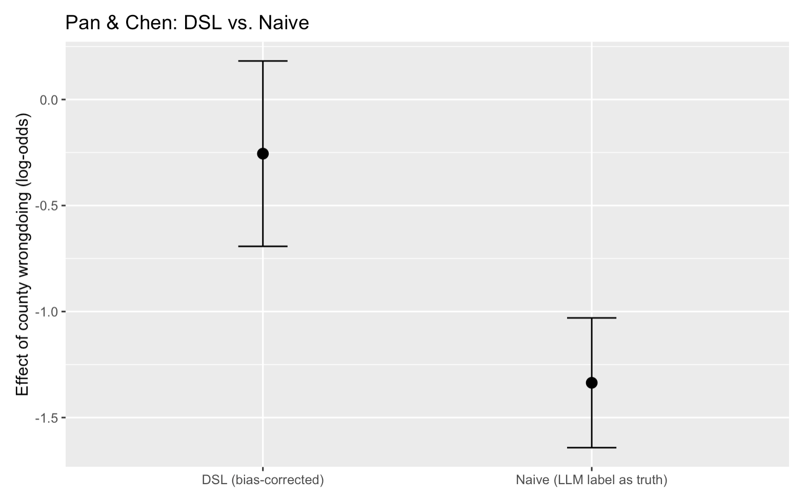
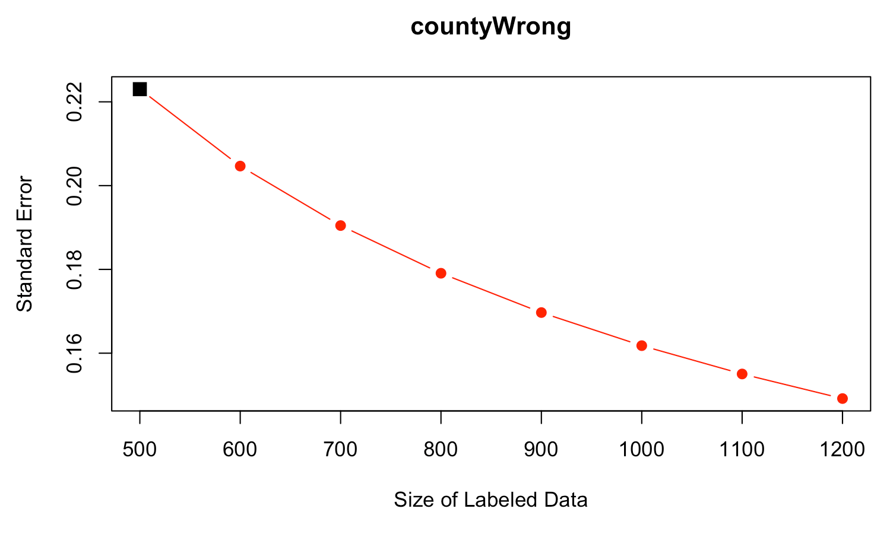

# Overview

Today you replicate a slice of **Chae & Davidson (2025)**: annotating the SemEval-2016 stance-detection benchmark with an LLM. Each tweet is labeled by the author's stance toward a named target politician — **FAVOR**, **AGAINST**, or **NONE**. That is a three-class problem with two targets (Trump and Clinton).

The plan:

1. **Set up your API key** 
2. **Prepare your data** — download the SemEval-2016 stance corpus, split train/test, sample a 200-tweet lab set
3. **Prepare your prompt** 
4. **Send the requests** — try with one call, then 200
5. **Get the labels back** — parsing three-class output to dataframe
6. **Evaluate** — accuracy, precision, recall, F1, macro vs. weighted, and a per-target breakdown
7. **DSL (in R)** — a hands-on version of Egami et al.'s DSL, applied to the substantive quantity ("share of tweets that oppose the target")
8. **Optional:** annotate an image

---

# 1. Setting Up Your API Key

## 1.1 Choose a provider

The lab is written against **Google Gemini**, which offers a genuine free tier with no payment method required. Other providers work with a few line changes — see the tabs.

::: {.panel-tabset}

### Google Gemini (recommended, free tier)

1. Go to [aistudio.google.com](https://aistudio.google.com) and click **Get API key**.
2. The free tier requires **no payment method** — it has generous daily request limits (thousands of requests per day on Flash models) that are ample for this lab.
3. Copy your key; you can regenerate it later from the same page.

*This is what the lab code uses. Everything below assumes Gemini.*

### OpenAI

1. Create an account at [platform.openai.com](https://platform.openai.com).
2. **Billing → add credit.** The minimum is small ($5) and does not auto-renew unless you turn that on. This is a *prepaid* balance: when it runs out, calls fail — they do not bill you further.
3. **Settings → Limits:** set a monthly spend cap (e.g. $5) so a runaway loop cannot cost you more.
4. **API keys → Create new secret key.** Copy it now; you cannot view it again.
5. To use OpenAI instead of Gemini, `pip install openai`, then replace the client-and-call block in §1.4 with the OpenAI equivalent — the rest of the lab is unchanged.

### Anthropic

1. Create an account at [console.anthropic.com](https://console.anthropic.com), add credit, create a key.
2. `pip install anthropic`; the call syntax differs slightly from Gemini's. See Anthropic's docs.

### Together / OpenRouter

1. Useful if you want **open-weight** models (Llama, Mistral, Qwen) without running them locally.
2. Both expose an OpenAI-compatible endpoint — install `openai` and set `base_url` to `"https://api.together.xyz/v1"` or `"https://openrouter.ai/api/v1"`.

:::

::: {.callout-tip collapse ="true"}
## Rate limits
Providers cap how many requests and tokens you may send per minute. Exceeding the cap returns an error (HTTP 429), not a charge. 
:::

## 1.2 Store the key safely

::: {.callout-warning collapse ="true"}
## Never put API keys in a notebook, a script, or a git commit
Keys get scraped off GitHub within minutes of being pushed. If you ever paste one into code by accident: revoke it in the console immediately and issue a new one.
:::

::: {.callout-warning collapse ="true"}
## Create the file in Terminal, not in Finder or a Save-As dialog
The file's name must be exactly **`.env`** — starting with a dot, with **no extension after it**. macOS Finder hides extensions by default, and TextEdit's "Save As…" silently appends `.txt`, giving you a file called `.env.txt` that `load_dotenv()` will never find. If your key won't load, this is almost certainly why.
:::

From your repo folder, in a **Terminal** window (not a Save dialog):

```bash
cd ~/active_repos/ai_for_socsci_fall2026    # your repo folder
touch .env
open -e .env                                # opens in TextEdit; on Windows use: notepad .env
```

Put one line in it — no quotes, no spaces around `=`, no trailing whitespace:

```text
GOOGLE_API_KEY=AIzaSy...your-actual-key-goes-here
```

Save, close, and verify the **filename** from Terminal:

```bash
ls -la .env*
# You want to see:   ...  .env
# NOT:               ...  .env.txt
```

If you see `.env.txt`, rename it and try again:

```bash
mv .env.txt .env
```
Then confirm `.env` is ignored by git — the course repo's `.gitignore` already lists it:

```bash
git check-ignore -v .env      # should print a line naming .gitignore
```

## 1.3 Install and load

```bash
source ~/aisocsci-env/bin/activate     # macOS/Linux
# ~/aisocsci-env\Scripts\activate       # Windows

pip install google-genai python-dotenv
```

Launch Jupyter **from the folder that contains `.env`**:

```bash
cd ~/active_repos/ai_for_socsci_fall2026
jupyter notebook
```

Then in a new notebook — **run this diagnostic cell first**, before anything else:

```python
import os
import re
from dotenv import load_dotenv, find_dotenv

env_path = find_dotenv(usecwd=True)          # searches cwd and upward
print(f"working directory   : {os.getcwd()}")
print(f"found .env at       : {env_path or 'NOT FOUND'}")

loaded = load_dotenv(env_path) if env_path else False
print(f"load_dotenv() said  : {loaded}")

if "GOOGLE_API_KEY" in os.environ:
    key = os.environ["GOOGLE_API_KEY"]
    print(f"key loaded          : {key[:6]}...{key[-4:]}   ({len(key)} characters)")
else:
    print("GOOGLE_API_KEY is NOT set — see troubleshooting below")
```

::: {.callout-tip}
## Expected output when it works
```text
working directory   : /Users/you/active_repos/ai_for_socsci_fall2026
found .env at       : /Users/you/active_repos/ai_for_socsci_fall2026/.env
load_dotenv() said  : True
key loaded          : AIzaSy...c9x2   (39 characters)
```
Printing the first and last few characters is a safe way to confirm the key loaded. **Never print the whole key.**
:::

::: {.callout-note collapse="true"}
## Troubleshooting — what each failure mode means

| What you see | What it means | Fix |
|---|---|---|
| `found .env at: NOT FOUND` | No file called exactly `.env` in this folder or a parent | Run `ls -la .env*` in Terminal — if you see `.env.txt`, do `mv .env.txt .env` |
| `found .env at: …/.env` but `load_dotenv(): False` | File exists but is empty, or has non-standard encoding | Open it in a plain text editor, confirm one line `GOOGLE_API_KEY=...`, save as UTF-8 |
| `load_dotenv(): True` but `GOOGLE_API_KEY is NOT set` | The variable is named something else in the file | Check for typos: `GEMINI_API_KEY`, `GOOGLE_KEY`, extra spaces around `=` |
| Everything looks right but a later cell still gets `KeyError` | Jupyter kernel started before the file existed | **Kernel → Restart Kernel**, then re-run this cell |
| `find_dotenv` shows a file in a *different* folder than expected | Jupyter was launched from the wrong directory | Quit Jupyter, `cd` to your repo folder, launch again from there |

After the diagnostic cell prints your key OK, this is the cell you use in the rest of the lab:
:::

```python
from google import genai
from google.genai import types
client = genai.Client(api_key=os.environ["GOOGLE_API_KEY"])
```

## 1.4 Choose an LLM, test with one call

We use **Gemini 3.7 Flash** for the entire lab — it is small, fast, and inside the free tier. Set it once by defining the `MODEL` variable. Then run one test call:

```python
MODEL = "gemini-3.7-flash"

r = client.models.generate_content(
    model=MODEL,
    contents="Reply with exactly one word: hello",
    config=types.GenerateContentConfig(
        temperature=0,
        max_output_tokens=5,
        automatic_function_calling=types.AutomaticFunctionCallingConfig(disable=True),
    ),
)
print(r.text)
print("tokens — in:", r.usage_metadata.prompt_token_count,
      "out:", r.usage_metadata.candidates_token_count)
```

::: {.callout-tip}
## Expected output
```text
hello
tokens — in: 8 out: 1
```
:::

::: {.callout-note collapse="true"}
## Why `automatic_function_calling=...(disable=True)` is on every call
Gemini's SDK ships with an **automatic function-calling** system that handles multi-turn tool use in a Chat session. For stateless annotation like ours — one prompt in, one label out, no tools — AFC has nothing to do, but if you leave it on, the SDK prints a warning encouraging you to use `Chat.send_message` instead. `Chat` is the wrong abstraction here (each call would grow its own conversation history over 200 tweets), so the current best practice is to **disable AFC on the config** and stick with `generate_content`. That's the one extra line you'll see in every call for the rest of the lab.
:::

::: {.callout-note collapse="true"}
## If that failed — common errors
| Message | Meaning | Fix |
|---|---|---|
| `PermissionDenied` / `API key not valid` | Key is wrong, revoked, or has a stray space/newline | Re-copy the key from [aistudio.google.com](https://aistudio.google.com); check `.env` has no quotes |
| `KeyError: 'GOOGLE_API_KEY'` | `.env` not found | Launch Jupyter from the folder containing `.env`, or pass the path to `load_dotenv()` |
| `ResourceExhausted` / `429` | Hit the per-minute free-tier limit | Wait 30 seconds and try again; a serial loop stays well under the quota |
| `NotFound: model ...` | Model id wrong or not available on your key | Check the current model list at [ai.google.dev/models](https://ai.google.dev/gemini-api/docs/models) |
:::

---

# 2. Prepare Your Data

We use the same benchmark **Chae & Davidson (2025)** use: **SemEval-2016 Task 6**, a set of 1,691 tweets from the 2016 US election, each labeled by the author's stance toward one of two named targets — **Donald Trump** or **Hillary Clinton**. The labels are three-way: **FAVOR**, **AGAINST**, **NONE**.

We pull the CSV from the paper's replication repository:

```python
import pandas as pd, numpy as np
from sklearn.model_selection import train_test_split

URL = ("https://raw.githubusercontent.com/yjin-chae/"
       "LLMs-for-text-classification/main/data/original/semeval_2016.csv")

df = pd.read_csv(URL, encoding="latin-1")           # the file has non-UTF-8 bytes
df = df[["Tweet", "Target", "Stance"]].reset_index(drop=True)

print(df.shape)
print("\nTarget x Stance:")
print(pd.crosstab(df["Target"], df["Stance"], margins=True))
```

::: {.callout-tip}
## Expected output
```text
(1691, 3)

Target x Stance:
Stance           AGAINST  FAVOR  NONE   All
Target
Donald Trump         299    148   260   707
Hillary Clinton      565    163   256   984
All                  864    311   516  1691
```
:::

::: {.callout-note}
## Read the crosstab before you code
- The data are **imbalanced**: AGAINST is more than half the corpus overall, FAVOR is under 20%. Whatever we build will look artificially good on AGAINST if we only report accuracy.
- **Clinton has almost 60% more tweets than Trump**, and the stance mix differs (Clinton skews AGAINST, Trump is closer to uniform). That is a covariate that could be correlated with LLM error rate — exactly the situation §7 addresses.
- The label is **conditional on a target**. In this file every tweet appears once with one pre-assigned target, but the *concept* being measured is stance toward that named person, not the tweet's overall mood. A hypothetical tweet like "I love Bernie, screw Trump" is FAVOR-toward-Sanders and AGAINST-toward-Trump; the SemEval team fixed one target per row rather than double-labeling. Practically, this means the prompt in §3 must send the target along with the tweet — the model needs to know *which stance* it is asked to code.
:::

Now split. Stratify by `Target × Stance` so both stratifications survive the split:

```python
strat = df["Target"] + "|" + df["Stance"]

train_df, test_df = train_test_split(df, test_size=0.30, random_state=42, stratify=strat)
train_df = train_df.reset_index(drop=True)
test_df  = test_df.reset_index(drop=True)

# 200-tweet held-out lab set. Everything below is scored on this.
lab_df = test_df.sample(n=200, random_state=42).reset_index(drop=True)

print(f"train {len(train_df)}   test {len(test_df)}   lab set {len(lab_df)}")
print("\nlab set Target x Stance:")
print(pd.crosstab(lab_df["Target"], lab_df["Stance"]))
```

::: {.callout-tip}
## Expected output
```text
train 1183   test 508   lab set 200

lab set Target x Stance:
Stance           AGAINST  FAVOR  NONE
Target
Donald Trump          42     20    31
Hillary Clinton       59     14    34
```
:::

---

# 3. Prepare Your Prompt

## 3.1 Replicate the zero-shot prompt in the paper

The main lab uses **Chae & Davidson's actual zero-shot prompt for GPT-4o**, copied out of their replication package (`3.GPT4o_semeval.ipynb`, variable `prompt3`). Everything goes in the `user` role — the paper uses no `system` message at all. The model is asked to infer both the target *and* the stance, and to output them in a `{TARGET, STANCE}` string.

```python
LABELS = ["AGAINST", "FAVOR", "NONE"]

# The paper's exact zero-shot prompt, copied verbatim from prompt3 in the
# replication package. Note the trailing "\n\n" — the tweet gets appended after.
PROMPT = (
    "These statement contains a TARGET and a STANCE. The target is a politician "
    "and the stance represents the attitude expressed about them. The target "
    "options are Trump or Clinton and stance options are Favor, Against or None. "
    "Provide the answer in the following format: {TARGET, STANCE}\n\n"
)
```

The paper also does one line of tweet cleaning before sending — it strips the `#SemST` dataset marker and any leading/trailing whitespace. We do that inline every time we build a message, so it stays visible rather than hiding in a helper:

```python
tweet = "Some example tweet #SemST"
cleaned = tweet.replace("#SemST", "").strip()          # → "Some example tweet"
```

::: {.callout-note}
## What are not in this prompt
- **No system role.** The paper puts everything in `user` role. See our earlier discussion of why this matters less than tutorials suggest for a single-turn task.
- **No codebook definitions.** No "FAVOR means…", no edge rules. Just the three label names.
:::

## 3.2 Check the actual prompt

Before sending anything, print exactly what the model will receive for one tweet. If your paper's methods section says "we prompted GPT with the codebook", this is what "the prompt" is:

```python
row = lab_df.iloc[0]
tweet = row["Tweet"].replace("#SemST", "").strip()     # clean it, same as the paper does

print(PROMPT + tweet)
```

## 3.3 Try the prompt & annotation via a test call

Now send five tweets to the API and read the raw output.

```python
for k in range(5):
    row = lab_df.iloc[k]
    tweet = row["Tweet"].replace("#SemST", "").strip()
    r = client.models.generate_content(
        model=MODEL,
        contents=PROMPT + tweet,
        config=types.GenerateContentConfig(
            temperature=0,
            max_output_tokens=200,
            automatic_function_calling=types.AutomaticFunctionCallingConfig(disable=True),
        ),
    )
    reply = r.text
    print(f"[{k}] true=({row['Target']:15s}, {row['Stance']:8s})   "
          f"reply={reply.strip()[:80]!r}   ")
```

::: {.callout-note collapse="true"}
## `max_output_tokens=200`? Why so many for a `{TARGET, STANCE}` answer?
On simpler instruction-tuned models the answer is often just `{Trump, Against}` and 20 tokens is plenty. **Newer or "thinking" models** may pre-reason a paragraph before emitting the `{...}` string. 200 tokens gives them room; the parser in §5 finds the `{TARGET, STANCE}` block wherever it lands. If your model is reliably terse, drop this back to 30.
:::

---

# 4. Send API Requests for LLM Annotations

Now send all 200 tweets through the model. We keep this minimal — one loop, one request at a time — so the shape of the pipeline stays visible.

```python
def annotate_corpus(tweets, prompt=PROMPT, temperature=0):
    """Send every tweet to the model, one at a time. Returns a list of raw replies."""
    replies = []
    for tw in tweets:
        tweet = tw.replace("#SemST", "").strip()
        r = client.models.generate_content(
            model=MODEL,
            contents=prompt + tweet,
            config=types.GenerateContentConfig(
                temperature=temperature,
                max_output_tokens=200,
                automatic_function_calling=types.AutomaticFunctionCallingConfig(disable=True),
            ),
        )
        replies.append(r.text)
        if len(replies) % 25 == 0:
            print(f"  {len(replies)}/{len(tweets)} done")
    return replies

raw_zs = annotate_corpus(lab_df["Tweet"].tolist())
print(f"\n{len(raw_zs)} replies received. First one:\n{raw_zs[0]}")
```

::: {.callout-note}
## What each piece does
- **The `for` loop** sends one request at a time — the simplest possible pattern. Expect **2–5 minutes** for 200 tweets.
- **The progress print** every 25 tweets lets you see it isn't hung.
- **`prompt`** is a plain string argument. `PROMPT` (the zero-shot version from §3.1) is the default; write a different string and pass it in to try a variant.

Retries, caching, and speed-ups are deliberately not in this function. See the collapsed notes below for how to add each back when you need them.
:::

::: {.callout-note collapse="true"}
## Speeding this up when your rate limit allows it
API calls are I/O-bound: your Python spends 99% of the loop waiting for the server. Running several requests in parallel doesn't need multiple CPU cores — threads share one core just fine because they are all idle. On a paid-tier account you can drop the runtime from ~3 minutes to ~30 seconds with:

```python
from concurrent.futures import ThreadPoolExecutor

def annotate_corpus_fast(tweets, prompt=PROMPT, max_workers=8, temperature=0):
    def one(tw):
        tweet = tw.replace("#SemST", "").strip()
        r = client.models.generate_content(
            model=MODEL,
            contents=prompt + tweet,
            config=types.GenerateContentConfig(
                temperature=temperature,
                max_output_tokens=200,
                automatic_function_calling=types.AutomaticFunctionCallingConfig(disable=True),
            ),
        )
        return r.text
    with ThreadPoolExecutor(max_workers=max_workers) as ex:
        return list(ex.map(one, tweets))
```

**Rate limits are the concern, not your CPU.** Rough guidance:

- Google Gemini free tier (Flash): stay serial — the free-tier per-minute cap is tight
- Google Gemini paid tier: `max_workers=8` is fine
- OpenAI free trial: 3 requests / minute — even the serial version will fail
- OpenAI tier 1 (~$5 credit): ~500 RPM — `max_workers=8` is fine
- Anthropic build tier: ~50 RPM — start with `max_workers=4`

If you see `ResourceExhausted` / HTTP 429, lower `max_workers`.
:::

::: {.callout-note collapse="true"}
## Adding retries and caching for a real corpus
For 200 tweets, a transient rate-limit or duplicated call costs you a rerun. For **100,000** tweets on a paid-tier model, the same failure modes cost you dollars and a debugging session. When you scale:

- **Retries.** Wrap the API call in `for attempt in range(5): try: ... except: time.sleep(2**attempt)`. Exponential backoff — 1s, 2s, 4s, 8s, 16s — is the standard pattern.
- **Caching.** Keep a dict keyed by `(model, hash(prompt + tweet))`; check it before calling. On a rerun after a crash, you don't re-pay for the calls that already succeeded.
- **Batch endpoints.** Google Gemini's Batch API, OpenAI's `/batches`, and Anthropic's Message Batches all take a file of requests and return results within 24 hours at roughly **half price**. This is the right tool at scale, not concurrent threading.
- **Save as you go.** Append each result to a `.jsonl` file rather than holding it in memory, so a crash at row 80,000 does not cost you the run.
:::

::: {.callout-note collapse="true"}
## Tracking token cost as you go
Google Gemini returns usage counts on every response: `r.usage_metadata.prompt_token_count` and `r.usage_metadata.candidates_token_count`. To print a running total, accumulate both across the loop and multiply by your model's per-million-token rate at the end (Flash is currently free within quota; check [ai.google.dev/pricing](https://ai.google.dev/pricing)).
:::

---

# 5. Obtain LLM Annotations & Convert Text Label to Data

Model output is text, not data. Parsing is where silent errors enter, so parse defensively and **count the failures**.

The paper's prompt asks for `{TARGET, STANCE}` — a target name and a stance name inside braces. The parser scans for that pattern *anywhere in the reply* (chatty models put reasoning around it), then normalizes case and surname/full-name variation to a fixed vocabulary.

```python
TARG_MAP   = {"trump": "Donald Trump", "clinton": "Hillary Clinton"}
STANCE_MAP = {"favor": "FAVOR", "against": "AGAINST", "none": "NONE"}

def parse(reply: str):
    """Extract (target, stance) from a model reply. Returns (None, None) on failure."""
    m = re.search(r"\{\s*([A-Za-z']+)\s*,\s*([A-Za-z]+)\s*\}", reply)
    if not m:
        return None, None
    target = TARG_MAP.get(m.group(1).lower().replace("'", ""))
    stance = STANCE_MAP.get(m.group(2).lower())
    return target, stance

parsed = [parse(r) for r in raw_zs]
n_bad_stance = sum(1 for _, s in parsed if s is None)
n_bad_target = sum(1 for t, _ in parsed if t is None)
print(f"unparseable stance : {n_bad_stance} / {len(parsed)}")
print(f"unparseable target : {n_bad_target} / {len(parsed)}")
```
::: {.callout-tip}
## Expected output
```text
unparseable stance : XXX / 200
unparseable target : XXX / 200
```
:::

```python
# Predictions -- default failures to NONE / the majority target (Clinton)
y_pred  = np.array([s if s in LABELS else "NONE" for _, s in parsed])
t_pred  = np.array([t if t is not None else "Hillary Clinton" for t, _ in parsed])
y_true  = lab_df["Stance"].to_numpy()
targets = lab_df["Target"].to_numpy()

lab_df_out = lab_df.copy()
lab_df_out["stance_pred"] = y_pred
lab_df_out["target_pred"] = t_pred
lab_df_out.to_csv("lab3_annotations.csv", index=False)
print(lab_df_out.head())
```
::: {.callout-tip}
## Expected output (your predictions may differ from the example below, but the output should be similar):
```text
                                               Tweet           Target  \
0  @3_Card_Monty : I believe the title would be "...  Hillary Clinton   
1  @FrankCraig: @skzdalimit if you're the best yo...  Hillary Clinton   
2  What does Ivana, NBC, Univision, Gemini's, and...     Donald Trump   
3  If the Obama cabinet was on the apprentice who...     Donald Trump   
4  'Hillary-speak' campaign rhetoric is going to ...  Hillary Clinton   

    Stance stance_pred      target_pred  
0     NONE        NONE  Hillary Clinton  
1     NONE        NONE     Donald Trump  
2  AGAINST     AGAINST     Donald Trump  
3     NONE        NONE     Donald Trump  
4  AGAINST     AGAINST  Hillary Clinton 
```
:::

::: {.callout-warning}
## Two decisions made in the above code
1. **Defaulting failed stance to "NONE".** Convenient — but "NONE" is a real class, so this biases NONE recall upward. With more than a handful of failures, either re-run those rows or drop them and report `n` honestly.
2. **The paper's prompt asks the model to *infer* the target.** A wrong target inference is a real error — a `{Clinton, Against}` prediction for a Trump tweet is wrong even if "AGAINST" happens to match the gold stance. §6 measures target-inference accuracy separately (§6.1), stance-only performance (§6.2), stance broken down by gold target (§6.3), and the paper's headline **joint** metric — both target and stance correct — in §6.4.
:::

---

# 6. Evaluate

Now we evaluate the model's performance against expert labels. This is a multi-class case, and we will talk about the difference between **macro** and **weighted** averaging in §6.2.

## 6.1 Evaluate performance on predicting TARGET

Because the paper's prompt asks the model to *infer* the target, the first thing to check is how often it got that inference right:

```python
target_acc = (t_pred == targets).mean()

# Overall accuracy
print(f"target inferred correctly: {(t_pred == targets).sum()}/{len(targets)}  "
      f"({target_acc:.1%})")

# The Confusion Matrix
print("\nTarget confusion matrix:")
print(pd.crosstab(pd.Series(targets, name="true"),
                  pd.Series(t_pred, name="predicted"), margins=True))
```
::: {.callout-tip}
## Expected output (your numbers may differ from the example below, but the output format should be similar):
```text
target inferred correctly: 159/200  (79.5%)

Target confusion matrix:
predicted        Donald Trump  Hillary Clinton  All
true                                               
Donald Trump               62               31   93
Hillary Clinton            10               97  107
All                        72              128  200
```
:::
::: {.callout-note}
## Why measure this first
The paper's headline metric is "F1 joint" — both target *and* stance correct. If your model is only 80% accurate at recognizing which politician the tweet is about, its stance F1 is capped even if its stance reasoning is perfect.
:::

## 6.2 Evaluate performance on predicting STANCE

`sklearn.metrics.classification_report` prints per-class precision/recall/F1 plus two averages side by side. It is a useful function to call.

```python
from sklearn.metrics import (classification_report, confusion_matrix,
                             accuracy_score, precision_recall_fscore_support,
                             cohen_kappa_score)

print(f"n = {len(y_true)}\n")
print(f"accuracy       : {accuracy_score(y_true, y_pred):.3f}")
print(classification_report(y_true, y_pred, labels=LABELS, digits=3))
```
::: {.callout-tip}
## Expected output (your numbers may differ from the example below, but the output format should be similar):
```text
n = 200

accuracy       : 0.690
              precision    recall  f1-score   support

     AGAINST      0.875     0.554     0.679       101
       FAVOR      0.630     0.853     0.725        34
        NONE      0.589     0.815     0.684        65

    accuracy                          0.690       200
   macro avg      0.698     0.741     0.696       200
weighted avg      0.740     0.690     0.688       200
```
:::

::: {.callout-note}
## What to expect
Chae & Davidson's **best fine-tuned model** on the SemEval Twitter task reached F1 = **0.69**; zero-shot and few-shot runs of GPT-class models generally landed well below that upper bound. Numbers in that neighborhood for a zero-shot prompt are a real result — see the paper's tables for the full set of comparisons.

If your numbers are wildly outside that band — say, accuracy below 0.4 or above 0.95 — the parser probably failed silently. Print `raw_zs[:5]` and check the format matches the regex in §5.
:::

The confusion matrix shows where each mislabel goes:

```python
cm = pd.DataFrame(confusion_matrix(y_true, y_pred, labels=LABELS),
                  index=[f"true_{l}" for l in LABELS],
                  columns=[f"pred_{l}" for l in LABELS])
print(cm)
```
::: {.callout-tip}
## Expected output (your numbers may differ from the example below, but the output format should be similar):
```text
              pred_AGAINST  pred_FAVOR  pred_NONE
true_AGAINST            56          12         33
true_FAVOR               1          29          4
true_NONE                7           5         53
```
:::

## 6.3 STANCE Performance by TARGET

It is important to understand if the predictions are biased by target. The paper reports that most methods do noticeably worse on Trump tweets than on Clinton tweets. We can check the evaluation by target to see if that is the case in our run.

```python
for t in ["Donald Trump", "Hillary Clinton"]:
    m = targets == t
    p, r, f, _ = precision_recall_fscore_support(y_true[m], y_pred[m], labels=LABELS,
                                                 average="macro", zero_division=0)
    acc = accuracy_score(y_true[m], y_pred[m])
    print(f"{t:18s}  n={m.sum():3d}   acc {acc:.3f}   macro Precision {p:.3f}   "
          f"macro Recall {r:.3f}   macro F1 {f:.3f}")
```
::: {.callout-tip}
## Expected output (your numbers may differ from the example below, but the output format should be similar):
```text
Donald Trump        n= 93   acc 0.656   macro Precision 0.692   macro Recall 0.706   macro F1 0.670
Hillary Clinton     n=107   acc 0.720   macro Precision 0.692   macro Recall 0.765   macro F1 0.703
```
:::

::: {.callout-note}
You can examine the performance by other covariates you care about: user metadata, time, region. If you can imagine writing "we find X for group A but not for group B", first check whether the model's error rate is different for A and B.
:::

## 6.4 Joint TARGET + STANCE performance

So far §6.1 and §6.2 have evaluated the two halves of the model's output separately. Chae & Davidson (2025) reported a **joint** metric: a prediction counts as correct only if the model got **both** the target *and* the stance right. The joint evaluation is a 6-class problem — one class per `(target, stance)` combination, applying the same metrics we use:

```python
# Treat (target, stance) as a single composite class label. sklearn wants a plain
# scalar label per sample, so we join the two fields into one string like
# "Donald Trump|AGAINST" rather than using a Python tuple.
joint_true = np.array([f"{t}|{s}" for t, s in zip(targets, y_true)])
joint_pred = np.array([f"{t}|{s}" for t, s in zip(t_pred,  y_pred)])

JOINT_LABELS = [f"{t}|{s}"
                for t in ["Donald Trump", "Hillary Clinton"]
                for s in LABELS]

joint_acc = (joint_true == joint_pred).mean()
p, r, f, _ = precision_recall_fscore_support(
    joint_true, joint_pred, labels=JOINT_LABELS,
    average="macro", zero_division=0)

print(f"joint accuracy  : {joint_acc:.3f}   "
      f"(both target AND stance correct on {int((joint_true == joint_pred).sum())} / "
      f"{len(joint_true)} tweets)")
print(f"joint macro F1  : {f:.3f}   (macro-averaged across all 6 (target, stance) classes)")
```
::: {.callout-tip}
## Expected output (your numbers may differ from the example below, but the output format should be similar):
```text
joint accuracy  : 0.570   (both target AND stance correct on 114 / 200 tweets)
joint macro F1  : 0.584   (macro-averaged across all 6 (target, stance) classes)
```
:::

```python
# Where does the joint metric drop below §6.2's stance-only F1?
stance_correct = (y_pred == y_true)
target_correct = (t_pred == targets)
both           = stance_correct & target_correct
print(f"of {len(y_true)} tweets:")
print(f"  stance correct only : {(stance_correct & ~target_correct).sum():3d}")
print(f"  target correct only : {(~stance_correct & target_correct).sum():3d}")
print(f"  both correct        : {both.sum():3d}")
print(f"  both wrong          : {(~stance_correct & ~target_correct).sum():3d}")
```
::: {.callout-tip}
## Expected output (your numbers may differ from the example below, but the output format should be similar):
```text
of 200 tweets:
  stance correct only :  24
  target correct only :  45
  both correct        : 114
  both wrong          :  17
```
:::

::: {.callout-note}
## Practice on your own (optional, these might need you to pay for more tokens)
1. **Re-run at `temperature=1`.** How often does the model disagree with itself on identical input? 
2. **Rewrite `PROMPT`.** Try a longer, more codebook-style prompt with explicit edge rules, and try few-shot prompting that is in this project's replication package. Does the preformance improve? 
3. **Try a bigger model** on the same 200 tweets — swap `MODEL` for `"gemini-3.7-pro"` and record the F1 difference (and the noticeable time difference).
:::

---

# 7. Design-based Supervised Learning (DSL) (R Studio)

This section leads you to try the DSL package introduced in the Egami et al. paper.

## 7.1 Install and load `dsl` R package and Pan & Chen's (2018) data

We switch to R for this section. Everything below runs in a fresh R chunk (in Quarto/RMarkdown) or in RStudio.

```r
if (!requireNamespace("dsl", quietly = TRUE)) {
  if (!requireNamespace("devtools", quietly = TRUE)) install.packages("devtools")
  devtools::install_github("naoki-egami/dsl", dependencies = TRUE)
}
library(dsl)
library(dplyr)
library(ggplot2)
```

The package ships with the **Pan & Chen (2018)** dataset — the study of whether online complaints accusing Chinese local officials of corruption get reported upward. `countyWrong` is the variable that needs annotation ("does this complaint accuse *county-level* officials?"), and it takes hundreds of RA-hours to code. `pred_countyWrong` is what happens when you ask GPT-4 to do it instead:

```r
data("PanChen")
glimpse(PanChen[, c("SendOrNot", "countyWrong", "pred_countyWrong")])
```

::: {.callout-important}
## Important — students do not run any LLM for this example
Both columns are already in the dataset:

- `countyWrong` — expert-coded, filled in for ~500 documents, `NA` elsewhere.
- `pred_countyWrong` — **GPT-4 annotations**, filled in for *every* row. The Egami team ran GPT-4 on the whole corpus once and shipped the results as part of `data("PanChen")`.

So every student gets identical inputs — no API budget, no model drift, no disagreement.
:::

**Step 1 — the naive regression** (what a researcher who ignores annotation error would run):

```r
m_naive <- glm(SendOrNot ~ pred_countyWrong + prefecWrong + connect2b +
                 prevalence + regionj + groupIssue,
               data = PanChen, family = binomial())
summary(m_naive)
```

**Step 2 — the DSL-corrected regression:**

```r
m_dsl <- dsl(
  model         = "logit",
  formula       = SendOrNot ~ countyWrong + prefecWrong + connect2b +
                    prevalence + regionj + groupIssue,
  predicted_var = "countyWrong",         # the variable that needed annotation
  prediction    = "pred_countyWrong",    # the LLM's guess
  data          = PanChen,
  cross_fit     = 5,                     # 5-fold cross-fit for the ML gap model
  sample_split  = 10,                    # 10 sample splits, averaged, for stability
  seed          = 2025
)
summary(m_dsl)
```

Compare the coefficient on wrongdoing side by side:

```r
cmp <- tibble(
  method   = c("Naive (LLM label as truth)", "DSL (bias-corrected)"),
  estimate = c(coef(m_naive)["pred_countyWrong"],
               m_dsl$coefficients["countyWrong"]),
  se       = c(sqrt(diag(vcov(m_naive)))["pred_countyWrong"],
               m_dsl$standard_errors["countyWrong"])
)

ggplot(cmp, aes(method, estimate)) +
  geom_point(size = 3) +
  geom_errorbar(aes(ymin = estimate - 1.96 * se,
                    ymax = estimate + 1.96 * se), width = 0.15) +
  labs(x = NULL, y = "Effect of county wrongdoing (log-odds)",
       title = "Pan & Chen: DSL vs. Naive")
```
::: {.callout-tip collapse="true"}
## Expected output:
{width="60%"}
:::
The DSL point estimate is what you would report in a paper; the naive estimate is what you would report if you were unaware of the correction, which typically would be biased.

## 7.3 Power analysis: how many more expert labels do I need?

Once your `dsl()` fit exists, `power_dsl()` tells you what standard errors you would get at other annotation budgets:

```r
pwr <- power_dsl(dsl_out = m_dsl, labeled_size = seq(500, 1200, by = 100))
summary(pwr)
plot(pwr, coef_name = "countyWrong")
```
::: {.callout-tip collapse="true"}
## Expected output:
{width="60%"}
:::

The plot shows the projected SE as a function of the number of expert labels. It can be used to answer the question:"if I code another 200 documents, does my confidence interval shrink enough to be worth it?" Per the paper's advice, once your LLM is reasonable, spend the effort on more expert labels rather than shopping for a bigger model.

# 8. Optional: Annotating an Image

Law & Roberto's pipeline is the same one you just built, with an image in the payload instead of text. If you have time, and a URL to any image:

```python
# The image lives in the course repo under weeks/week03/images/. 
# You might need to change the path depending on your file structure.
# To try a different image, drop any .jpg into that folder and update IMG_PATH.
IMG_PATH = "images/Suburban_town_houses.jpg"

FEATURES = ["single-family houses", "apartment buildings", "highway", "fencing",
            "sidewalk", "dense vegetation", "parking lot", "railroad track"]

with open(IMG_PATH, "rb") as f:
    image_bytes = f.read()

image_part = types.Part.from_bytes(data=image_bytes, mime_type="image/jpeg")

r = client.models.generate_content(
    model=MODEL,                                     # Gemini Flash handles images natively
    contents=[
        "Which of the listed features appear in this image?",
        image_part,
    ],
    config=types.GenerateContentConfig(
        system_instruction=(
            "You label built-environment features in images for a research project. "
            f"Use ONLY these labels: {FEATURES}. "
            'Return JSON: {"features": [...]} and nothing else.'
        ),
        temperature=0,
        max_output_tokens=500,
        automatic_function_calling=types.AutomaticFunctionCallingConfig(disable=True),
    ),
)
print(r.text)
```

---

# Submitting your lab

```bash
git add .
git commit -m "Complete lab 3"
git push origin main
```
Or use GitHub Desktop or your IDE's Git integration to commit and push. Make sure you don't share your `.env` file with your API key. It should be in `.gitignore`.

::: {.callout-warning}
## Check before you push
```bash
git status --short          # .env must NOT appear
```
If your `.env` shows up, stop and add it to `.gitignore` before committing.
:::

You should upload **both your Jupyter notebook & a R script/R markdown** file with your DSL analysis. I will check them in the repo link you submitted in the [course form](https://docs.google.com/spreadsheets/d/1m3iRIgdCrZlePTTitDpsGe6I_jEPtDwF4oFMeNix2uw/edit?usp=sharing). You should submit them **by next Tuesday (Sep. 22nd)**.
