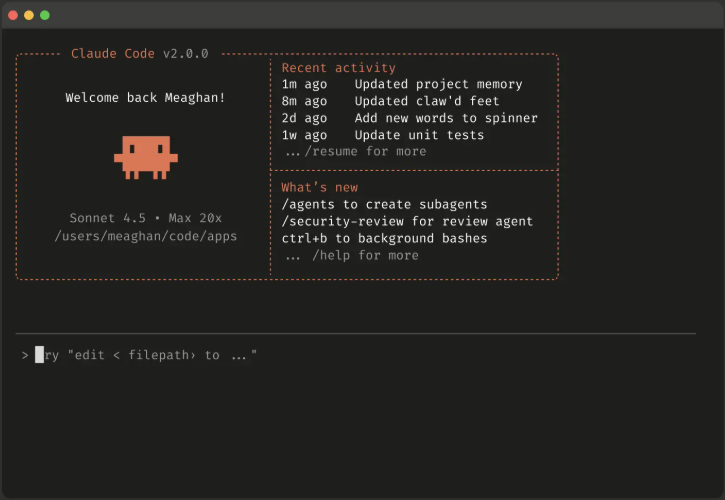
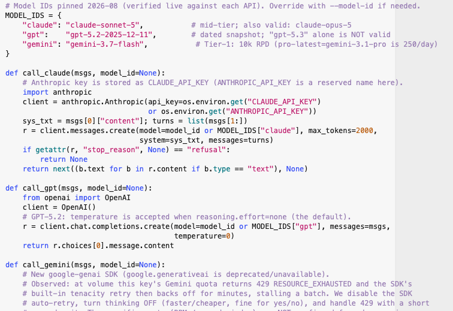
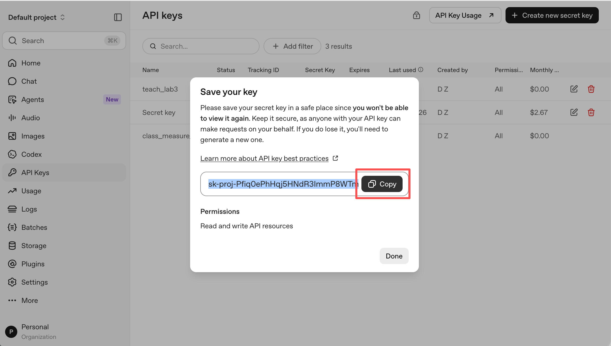
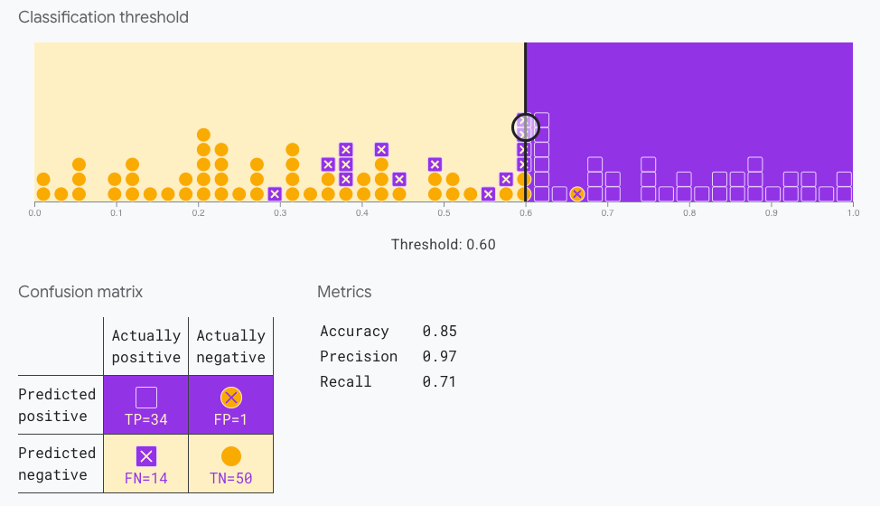
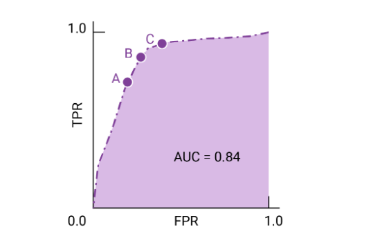

## Plan of Today & Logistics

- **[Student Presentation](https://docs.google.com/presentation/d/1AjUufNkEN8uH06ueezSmIjBVNmyFnEMj97UXBfl-s9Y/edit?slide=id.p#slide=id.p) & Discussion** ~60 min, clarifying questions on readings
- **Break** 10 min
- **Lecture** ~45 min, technical details on using LLMs APIs, evaluation metrics, design-based supervised learning
- **Lab** ~45 min

. . .

- Fill out this [survey](https://rutgers.ca1.qualtrics.com/jfe/form/SV_eg1AphbKWcjaZQW) for the **Sociology of AI** minicourse (see also the course canvas page).

- Next week's presentation (9/23): Simulating Subjects & Interactions, Survey Experiments, by Woojung & YJ

# Part 1. Using LLMs APIs {.center background-color="#CC0033"}

## Recap: Using GenAI -- Chat Interface, API, Command Line Interface
::: {style="font-size: 0.8em;"}
:::: {.columns}
::: {.column width="33%"}
**Chat Interface**: A conversational web/app interface. Easy to use (no coding). Handles multimodal input easily. Less flexible & difficult to scale for some research purposes.

{width="95%"}

:::


::: {.column width="33%"}
**API**: A programming interface to send requests and receive responses. More control over model parameters and easier to integrate into research pipeline. Requires writing, running, and maintaining code.

{width="95%" fig-align="center"}
:::


::: {.column width="33%"}
**CLI (Command Line Interface)**: A terminal-based interface. Uses command-line commands. Used to be better than chat interface for agentic workflow, but chat interfaces have caught up. 

{width="95%" fig-align="center"}

:::
::::


:::

## What is an API & why use it?

::: {.columns}

::: {.column width="40%"}
::: {style="font-size: 0.9em;"}
::: {.incremental}
- **API** = Application Programming Interface. 
- We use API to access LLMs programmatically:
     - **Scale & efficiency**: Send large amount of requests (such as annotation tasks), call multiple models
     - **Reproducibility**: Specify model version & other model parameters 
     - **Control**: Get structured output formats for downstream analysis
:::
:::
:::

::: {.column width="60%"}
. . .

{fig-align="center"}
:::

:::

## Using API: Basics
- Major LLM providers have Python package to help you access their APIs
- You need to get an "API Key" for each providers & pay usage credits
- Open-weights models like Llama can be run locally (you can download them from [HuggingFace](https://huggingface.co/models)), but stronger models are often too big to host locally. 
     - There are providers that allow you to use them via their API for a fee: Groq, TogetherAI, Fireworks AI, Hugging Face
     - You can also download softwares and run them locally at no charge: [Ollama](https://ollama.com/), [vLLM](https://vllm.ai/) --still require large local storage for stronger models


## Preview of Lab Code: Using API in Python -- API Key
- First, apply for API KEY at provider website and set it up in your environment. 




## Preview of Lab Code: Using API in Python -- API Key
- You should NEVER upload or share your API key. Make sure this is NOT sync-ed to your GitHub repo -- follow the lab instruction.
     - A brief walk through:

```bash
cd ~/active_repos/ai_for_socsci_fall2026    # Navigate to your repo folder
touch .env                                  # Edit or create a new, empty file called .env
open -e .env                                # opens in TextEdit; on Windows use: notepad .env
```

In the TextEdit file, put your API key:

```text
OPENAI_API_KEY=sk-your-actual-key-goes-here
```

Save, close, and verify the filename from your CLI:

```bash
ls -la .env*
# You want to see:   ...  .env
# NOT:               ...  .env.txt
```
Then confirm `.env` is **ignored by git** — the course repo's `.gitignore` already lists it:

```bash
git check-ignore -v .env      # should print a line naming .gitignore
```

## Preview of Lab Code: Using API in Python -- Simple usage

::: {style="font-size: 0.9em;"}
- After setting up the API client, you can test it by running a single request:
:::

```python
import os
from dotenv import load_dotenv, find_dotenv

# Load your API key to the programming enviornment
env_path = find_dotenv(usecwd=True)         
loaded = load_dotenv(env_path) if env_path else False

# Import API packaeg
from openai import OpenAI
client = OpenAI()     

# Define the model you use
MODEL = "gpt-5.4-mini-2026-03-17"

# Try the model: you can change the model parameters such as max token returned, temperature, etc. 
r = client.chat.completions.create(
    model=MODEL,
    # You can set system & user prompts, you can also sent chat record as messages
    messages=[{"role": "user", "content": "Explain what is an API in one sentence: "}],
    max_completion_tokens=30,
    temperature=0,
)

# Print the text generated from the model
print(r.choices[0].message.content)

```

::: {.callout-tip}

## Expected output

```text
An API (Application Programming Interface) is a set of rules that lets different software applications communicate and work with each other.
```

:::


## Preview of Lab Code: Using API in Python -- Function in analysis pipeline

::: {style="font-size: 0.9em;"}
- We can write a function that run such requests at scale. 
- For example, in the lab, you will let an LLM annotate tweets used in Chae & Davidson (2025) by identifying the "target" & "stance" in tweets: 
:::

```python
def annotate_corpus(tweets, prompt=PROMPT, temperature=0):
    """
    This function: (1) builds the prompt using the tweet, (2) sends every prompt to the model, one at a time,
    (3) returns a list of raw replies.
    """
    replies = []     
    for tw in tweets:
        tweet = tw.replace("#SemST", "").strip() 
        r = client.chat.completions.create(
            model=MODEL,
            messages=[{"role": "user", "content": prompt + tweet}],
            max_tokens=200,
            temperature=temperature,
        )
        replies.append(r.choices[0].message.content) 
        if len(replies) % 25 == 0:
            print(f"  {len(replies)}/{len(tweets)} done") 
    return replies

# The tweets are saved in the dataframe `lab_df` in the variable `Tweet`.
# Apply above function on every tweet in `lab_df` and save all response in the list: raw_zs
raw_zs = annotate_corpus(lab_df["Tweet"].tolist())
print(f"\n{len(raw_zs)} replies received. First one:\n{raw_zs[0]}")
```

## Using API in Python: Parse the returned list for downstream analysis

::: {style="font-size: 0.9em;"}
- Model output is **text**, not data. We need to convert each text output to manipulable **values**. 
- This function converts text like: `{Trump, None}` to a python tuple object with two elements: `('Donald Trump', 'NONE')`. We later convert the tuple list to dataframe variables. 
:::

```python
TARG_MAP   = {"trump": "Donald Trump", "clinton": "Hillary Clinton"}
STANCE_MAP = {"favor": "FAVOR", "against": "AGAINST", "none": "NONE"}

def parse(reply):
    """Extract (target, stance) from a model reply. Returns (None, None) on failure."""
    m = re.search(r"\{\s*([A-Za-z']+)\s*,\s*([A-Za-z]+)\s*\}", reply)
    if not m:
        return None, None
    target = TARG_MAP.get(m.group(1).lower().replace("'", ""))
    stance = STANCE_MAP.get(m.group(2).lower())
    return target, stance

parsed = [parse(r) for r in raw_zs]
n_bad  = sum(1 for _, s in parsed if s is None)
print(f"unparseable / invalid replies: {n_bad} / {len(parsed)}")
```

::: {.callout-note}
## Same pipeline runs on images, audio, and video
:::


# Part 2. Evaluating a Classifier {.center background-color="#CC0033"}


## Evaluation in Supervised Classification:

Evaluation tells us how well the model performs the classification task compared to the "ground truth." You should understand:

::: {.incremental}
- Difference in the evaluation methods & steps for conventional supervised ML vs. LLM annotations
- Key evaluation concepts: the confusion matrix, accuracy, precision, recall, F1, ROC, ROC-AUC
:::


## Evaluation Process in Conventional Supervised ML

::: {style="font-size: 0.9em;"}
::: {.incremental}
- You have a **labelled dataset** (the ground truth). Split into **train** and **test** sets.
- On the training set, train, tune & select ML models (logistic regression, tree-based models, BERT, etc.) — often with **cross-validation** (CV).
- Pick the best-performing model from the CV, then report its performance on the **held-out test set** — the model has never seen these labels.
:::
:::

. . .

{width="40%" fig-align="center"}

::: {style="text-align: center; font-size: 0.65em;"}
Source: [Scikit-Learn](https://scikit-learn.org/stable/modules/cross_validation.html)
:::

## Evaluation Process in LLM Annotations

::: {style="font-size: 0.77em;"}
Two common workflows, both cheaper than the conventional pipeline:

:::: {.columns}

::: {.fragment .column width="50%"}
**Process 1 — no fine-tuning** (today's lab):

1. LLM predicts labels for every document (zero- or few-shot).
2. Sample a subset for **expert coding** — the ground truth.
3. Compute classification metrics: LLM vs. expert labels.
4. Iterate model / prompt / temperature until acceptable.
:::

::: {.fragment .column width="50%"}
**Process 2 — with fine-tuning:**

1. Labelled dataset → split into **train** and **test**.
2. Fine-tune on the training set (prompts, epochs, lr).
3. Evaluate & pick candidates on a held-out training slice.
4. Report performance on the **unseen test set**.
:::

::::
:::
 
 . . .

::: {.callout-warning}
## Key differences from conventional ML
- **Both workflows rely on a single test set — no K-fold CV.** Paid API calls make cross-validation prohibitively expensive.
- **Process 1: reported metrics are upwardly biased.** Iterating prompts against the same expert-coded set leaks the "test set" into model selection.
- **Process 2 done properly: unbiased in expectation, but noisy.** One test set → high variance in the estimate. And *any* peeking at test performance to tune reintroduces the Process-1 bias.
- LLMs annotations might have unknown bias or errors: **bias correction downstream using the DSL framework**.
:::

## Key Metrics: Confusion Matrix and Accuracy

::: {style="font-size: 0.85em;"}
- The **confusion matrix** counts every combination of "what is true" × "what the model said". Everything other numeric metric in this section is built from these four numbers.

|              | pred = positive | pred = negative |
|--------------|-----------------|-----------------|
| **true positive** | true positive (**TP**) | false negative (**FN**) |
| **true negative** | false positive (**FP**) | true negative (**TN**) |

. . .

1. **Accuracy**: *fraction of cases the model got right*.
$$
\text{Accuracy} =
\frac{\text{correct classifications}}{\text{total classifications}}
= \frac{TP+TN}{TP+TN+FP+FN}
$$

:::

. . .

::: {.callout-important title="Accuracy is misleading on imbalanced data"}
::: {style="font-size: 1em;"}
If only 15% of tweets are AGAINST-Trump, an annotator that flags *nothing* still gets **85% accuracy**. It found zero real AGAINST tweets.

You need **class-specific** metrics to see this.
:::
:::


## Key Metrics (cont.): Recall, False Positive Rate, Precision

::: {style="font-size: 0.85em;"}
2. **Recall, or true positive rate**: the proportion of all actual positives that were classified correctly as positives - *"of all the spam emails, how many (what fraction) did the model detect?"*
$$
\text{Recall (or TPR)} =
\frac{\text{correctly classified actual positives}}{\text{all actual positives}}
= \frac{TP}{TP+FN}
$$

. . .

3. **False positive rate**: the proportion of all actual negatives that were classified *incorrectly* as positives - *"how many (what fraction of) legitimate emails were incorrectly classified as spam?"*
$$
\text{FPR} =
\frac{\text{incorrectly classified actual negatives}}
{\text{all actual negatives}}
= \frac{FP}{FP+TN}
$$

. . .

3. **Precision**: the proportion of all the model's positive classifications that are actually positive - *"how many (what fraction of) emails classified as spam were actually spam?"*
$$
\text{Precision} =
\frac{\text{correctly classified actual positives}}
{\text{everything classified as positive}}
= \frac{TP}{TP+FP}
$$

:::

## Key Metrics (cont.): F1 & Comparing Metrics

4. **F1 = 2 · Precision · Recall / (Precision + Recall)** — the harmonic mean, a single-number summary that punishes imbalance between the two.

. . .

#### Which metric is the most important? Depends on cost of being wrong

::: {.incremental}
- **Recall matters more** when a *false negative* is expensive, i.e. when missing the reality is dangerous or fatal: telling a patient that they don't have aggresive cancer when they actually do, failing to detect weapon in baggage check, auto-drive car sensor fails to detect pedestrain, ...

- **Precision matters more** when a *false positive* is expensive, i.e. when acting on a false alarm causes severe damage: innocent person being wrongfully accused of a crime, spam filter that filter important emails, AI/plagiarism detection flags a student paper that didn't use AI/plagiarize, ...

- **F1** when you want a measure that considers both recall and precision
:::


## Key Metrics 3: Threshold, ROC, AUC

:::: {.columns}

::: {.column width="60%"}

::: {style="font-size: 0.8em;"}

Traditional classifiers output a **score** (a probability), not a label. You choose a **threshold** to turn the score into a decision.

{width="65%" fig-align="center"}

::: {.incremental}
- Every threshold gives one (True-Positive Rate, False-Positive Rate) point. 
- Tracing them across all threshold values gives the **ROC curve**.
- **AUC-ROC** = area under that curve. AUC of 0.5 = random; 1.0 = perfect. It helps with picking a threshold. 
:::

:::

:::

::: {.column width="40%"}

{width="95%" fig-align="center"}

::: {style="text-align: center; font-size: 0.65em;"}
Source: [Google ML Crash Course](https://developers.google.com/machine-learning/crash-course/classification/roc-and-auc)
:::

:::

::::

## For LLM Annotators: Is There a Score?

An LLM by default outputs a **label**, not a score, but there are ways to reintroduce a score if you want ROC/AUC:

::: {.incremental}
1. **Token log-probabilities**: `logprobs=True` on the API call. Ask for the probability of each candidate label token. Most principled — this *is* the model's probability distribution.
2. **Verbalized confidence**: `{"stance": "AGAINST", "confidence": 85}`. Easy to add to the prompt, but empirically **poorly calibrated** — unclear how well the scores are calibrated.
3. **Consistency across runs**: Run the same prompt 10× at `temperature=1`, take the fraction of the positive class (costs 10× more).
:::

## Correcting LLM Prediction Errors using Design-based Supervised Learning (DSL)

::: {.incremental}

- **Motivation**: 
     1. LLM annotations make prediction errors, and we usually don't know the nature of the errors.  
     2. Even with excellet-performing LLMs, ignoring errors can lead to **large bias** in subsequent estimation, both in terms of *point estimates* and *conficence intervals*. (Egami et al.).

- **Intuition**: Borrow information in the comparison between expert labeling and LLM labeling. 

- **What DSL does**: 
     1. Fits an ML model (default: cross-fit random forest) on the expert-coded subset to learn how the LLM's predictions relate to the expert labels.  
     2. Uses that model to bias-correct any downstream regression that uses the LLM's predictions on the *full* corpus.

:::

## When You Can Use DSL

::: {.incremental}
1. **Prevalences and proportions** — share of documents in a category, at one time point or across time.
2. **Regression coefficients** — logit, linear, and fixed-effects models with the LLM-labeled variable on either side of the equation.
3. **Panel data** — one- or two-way fixed effects with cluster-robust standard errors (`model = "felm"`).
4. **Multiple LLM-labeled variables** — outcome *and* covariate both LLM-annotated; corrects for correlated errors between them.
5. **Unequal sampling probabilities** — when you oversampled hard cases; pass `sample_prob = "..."`.
:::


# Lab {.center background-color="#CC0033"}

**Open the lab page:** [Lab 3: LLM Annotation via API](lab.qmd)


