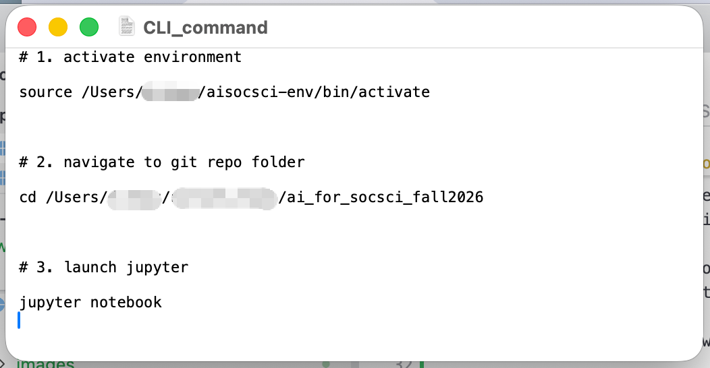
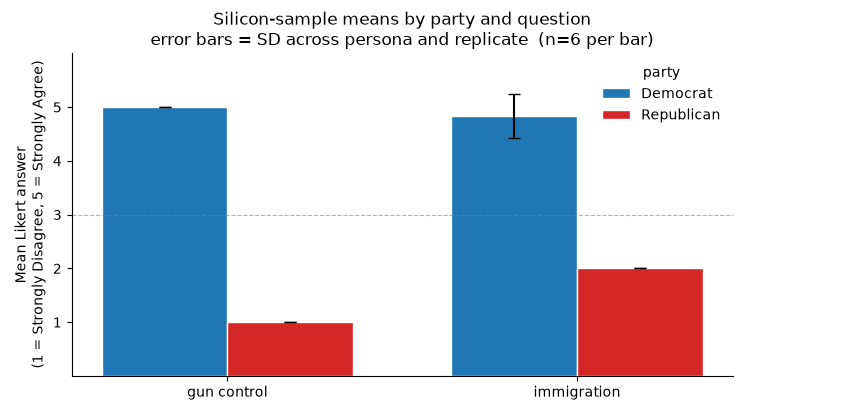
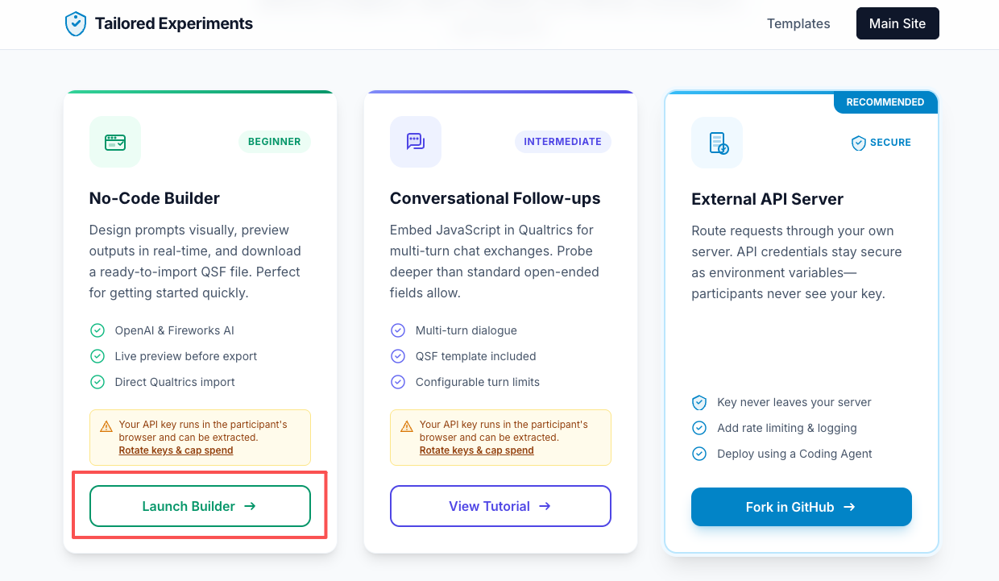
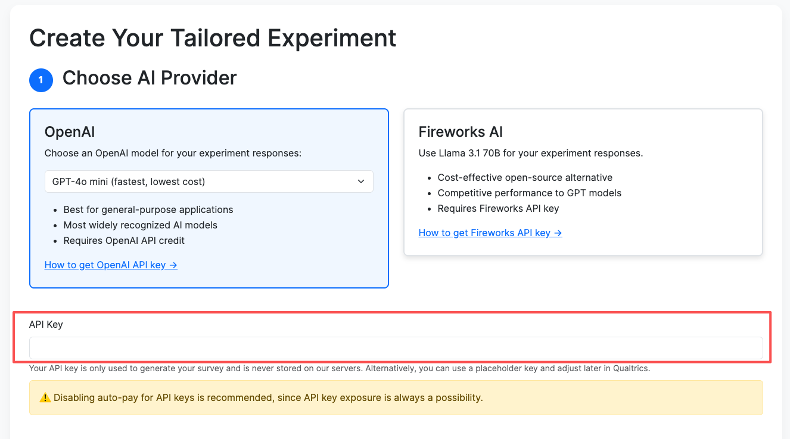

# Overview

This week we move from using LLM to **annotate/classify** documents to **generate** data for social analysis. The lab's plan:

1. **Silicon sampling**: Using LLM as survey respondents. By conditioning the LLM by using demographic backstories, we will replicate the core method used in **Argyle et al. (2023)** "Out of One, Many." We also examine the cautions and caveats documented in **Bisbee et al. (2024)** and **Kozlowski & Evans (2025)**.
2. **Tailored survey experiments**: Using LLM to generate *tailored treatment* in survey experiments. We will try out the tool published by **Velez & Liu (2025)**: [tailoredexperiments.com](https://tailoredexperiments.com/). You will need to supply API key and use Qualtrics to see how it works. 
3. **Generative agents**: Using LLM to simulate "believable" social agents who can observe, memorize, reflect, and plan. We will run a toy example with a **minimal two-agent conversation**, and you can check out the demo & code-repo for **Park et al. (2023)** (no local run — the full Smallville simulation is expensive). 


---

# 1. Setup

## 1.1 Activate your environment, open Jupyter Notebook in your repo folder

By this week, you should be able to activate your virtual enviornment & open Jupyter Notebook in your local copy of the GitHub repo foler with no problem. 

If you still struggle to do these steps, create a notebook/text file with the three lines of code, so that everytime you can copy-paste them in your CLI. 

{width="400"}


**Step 1**: Activate your virtual environment:

First, find out where is your `aisocsci-env` folder. For example, it might be saved in `/Users/yourname/aisocsci-env/`. If so, your first command will be: `source /Users/yourname/aisocsci-env/bin/activate`. If you successfully activated it, you should see that your command line now have a prefix like: `(aisocsci-env) 10-18-119-47:~ yourname$`

```bash
source path/to/aisocsci-env/bin/activate        # macOS/Linux
# ~/aisocsci-env\Scripts\activate          # Windows
```

Install the openai client in the virtual environment if you haven't:

```bash
pip install openai
```

**Step 2**: Navigate to the local Github repo folder:

```bash
cd path/to/your/repo_folder/ 
```

On Mac, you can find out the file path to this folder by simply dragging the folder to your CLI window. You will see a file path such as: `/Users/yourname/my_repos/ai_for_socsci_fall2026`. You need to type the following command in your CLI: `cd /Users/yourname/my_repos/ai_for_socsci_fall2026` and this will bring you to the directory of your repo folder. You will see from your CLI that both your virtual environment and your working location is shown before your username: `(aisocsci-env) 10-18-119-47:ai_for_socsci_fall2026 yourname$` 


**Step 3**: Launch Juypter notebook:

Once you are in your repo folder, you can activate Jupyter notebook by simply typing `jupyter notebook`:

```bash
# Make sure you run this command in the correct directory and with your virtual environment
jupyter notebook                           
```
After launching, create a new notebook for lab4 (e.g. `lab4.ipynb`) in the appropriate folder.

## 1.2 Set up API keys

Since we need OpenAI API for the **tailored experiment** tool anyways, you are **required to have an [OpenAI](https://platform.openai.com/login) API key** (sign in -> go to profile settings -> billing -> buy credits). The minimum credit is $5.

However, you don't have to use OpenAI API for the other parts of the lab. You can still try using the free tier of **Google Gemini**. You can also load credit to your Google Gemini API account to avoid rate limit issues (minimum is same as OpenAI, which is $5).

The lab code today allows you to choose which API to use: Google Gemini or OpenAI. 

You can add more API keys in the `.env` doc you created in Lab 3, such as the following example:

```bash
GOOGLE_API_KEY=AIzaSy...c9x2
OPENAI_API_KEY=sk-proj-...Ab3d
FIREFLY_API_KEY=...
```

To edit your `.env` file, use the CLI in-place editor: 
```bash
nano .env 
```
`nano` opens the file directly in the Terminal window. Type your edits, then `Ctrl+O` to save, `Ctrl+X` to quit.

## 1.3 Load your API key to Jupyter working environment 

Load the API key like last time. Choose one of the providers by **uncommenting the respective block** (below uses `OpenAI` as the provider):

```python
import os
from dotenv import load_dotenv, find_dotenv

load_dotenv(find_dotenv(usecwd=True))

# Pick ONE of the providers below by uncommenting the corresponding block.

## --- Google Gemini (free tier OK) ---------------------------------------
# from google import genai
# from google.genai import types
# client   = genai.Client(api_key=os.environ["GOOGLE_API_KEY"])
# MODEL    = "gemini-2.5-flash"
# PROVIDER = "gemini"

## --- OpenAI (paid) ------------------------------------------------------
from openai import OpenAI
client   = OpenAI(api_key=os.environ["OPENAI_API_KEY"])
MODEL    = "gpt-4.1-nano-2025-04-14"
PROVIDER = "openai"

print(f"Provider: {PROVIDER}   Model: {MODEL}")
```
::: {.callout-tip}
## Expected output
```text
Provider: openai   Model: gpt-4.1-nano-2025-04-14
```
:::


To keep the rest of the lab provider-agnostic, we define one wrapper function that returns plain text depending on the `PROVIDER` and `MODEL` of your choice. Instead of using the API's original chat completion function, we only need to call `chat(prompt)` in the following code. 

```python
def chat(prompt, temperature=1.0, max_tokens=200, system=None):
    """Provider-agnostic single-turn completion. Returns response text."""
    if PROVIDER == "gemini":
        r = client.models.generate_content(
            model=MODEL,
            contents=prompt,
            config=types.GenerateContentConfig(
                temperature=temperature,
                max_output_tokens=max_tokens,
                system_instruction=system,
                automatic_function_calling=types.AutomaticFunctionCallingConfig(disable=True),
            ),
        )
        return r.text
    if PROVIDER == "openai":
        msgs = ([{"role": "system", "content": system}] if system else []) + \
               [{"role": "user", "content": prompt}]
        r = client.chat.completions.create(
            model=MODEL, messages=msgs,
            temperature=temperature, max_tokens=max_tokens,
        )
        return r.choices[0].message.content

    raise ValueError(PROVIDER)

# Sanity check
print(chat("Reply with exactly one word: hello", temperature=0, max_tokens=20))
```

::: {.callout-tip}
## Expected output
```text
Hello
```
:::

---

# 2. Silicon Sampling

Basic steps of Silicon Sampling (Argyle et al. 2023):

- Provide LLM with socio-demographic profiles of an individual. 
- Ask the LLM what the person would respond to survey questions given their background. 
- Repeat the above steps across different types of socio-demographic groups, and examine the resulted distribution in comparison with survey data. 

To minize API calls, today's lab only present a **toy example** of a very small number of silicon sampling. We will also examine the **lack of variation** problem highlighed in Bisbee et al. (2024). 

## 2.1 Build a persona

The persona is a **first-person backstory** built from a fixed schema of demographic slots.  

Following Argyle et al.'s ANES-style schema:

```python
def create_persona(d):
    """
    Turn a demographics dict into a first-person backstory string.
    d keys: age, gender, race, education, region, income, party, ideology
    """
    return (
        f"I am a {d['age']}-year-old {d['race']} {d['gender']} from the "
        f"{d['region']} United States. My highest level of education is "
        f"{d['education']}. My household income is {d['income']}. "
        f"Politically, I identify as a {d['party']} and describe my views as "
        f"{d['ideology']}."
    )

# Two contrasting personas
persona_a = dict(age=68, gender="man",   race="white", education="high school",
                 region="Southern",  income="$45,000",  party="Republican",
                 ideology="conservative")

persona_b = dict(age=27, gender="woman", race="Black", education="a graduate degree",
                 region="Northeastern", income="$120,000", party="Democrat",
                 ideology="liberal")

print(create_persona(persona_a))
print()
print(create_persona(persona_b))
```

::: {.callout-tip}
## Expected output
```text
I am a 68-year-old white man from the Southern United States. My highest level of education is high school. My household income is $45,000. Politically, I identify as a Republican and describe my views as conservative.

I am a 27-year-old Black woman from the Northeastern United States. My highest level of education is a graduate degree. My household income is $120,000. Politically, I identify as a Democrat and describe my views as liberal.
```
:::

## 2.2 The survey-response function

We then create a function that asks a silicon respondent one Likert-scale question (you can design different question types) and obtain the answer from LLM: 

```python
import re, time
from collections import Counter

LIKERT_LABELS = {
    1: "Strongly Disagree", 2: "Disagree", 3: "Neither agree nor disagree",
    4: "Agree",             5: "Strongly Agree",
}

def silicon_sample_likert(demographics, question, scale=(1, 5), temperature=1.0):
    """
    Ask a single silicon respondent one Likert-scale question.

    Returns (int response in [scale[0], scale[1]]) or None if parsing fails.
    """
    persona = create_persona(demographics)
    prompt  = (
        f"{persona}\n\n"
        f"Please answer the following question as this person would.\n\n"
        f"Question: {question}\n\n"
        f"Respond with a single number from {scale[0]} to {scale[1]}, where "
        f"{scale[0]} = Strongly Disagree and {scale[1]} = Strongly Agree. "
        f"Reply with only the number."
    )
    reply = chat(prompt, temperature=temperature, max_tokens=200)
    m = re.search(rf"[{scale[0]}-{scale[1]}]", reply or "")
    return int(m.group()) if m else None
```
Try one call before you loop over anything:

```python
q = "The government should provide universal health care."
print("Persona A (conservative):", silicon_sample_likert(persona_a, q, temperature=0))
print("Persona B (liberal):    ", silicon_sample_likert(persona_b, q, temperature=0))
```

::: {.callout-tip}
## Expected output (order and exact numbers may vary by model)
```text
Persona A (conservative): 2
Persona B (liberal):     5
```
:::

## 2.3 Within-persona invariance

One important criticism from Bisbee et al. (2024) on silicon sampling id the lack of variations. If we give LLMs the *same* persona and the *same* question for ten times with `temperature=1.0`, we tend to get variations that are much smaller than comparing to actual survey data. This creates problems for statistical inference. 

Below we try a toy example of asking the LLMs 10 times with `temperature=1.0` and check the variation in its answers:

```python
question = "The government should provide universal health care."

replies = []
for i in range(10):
    r = silicon_sample_likert(persona_b, question, temperature=1.0)
    replies.append(r)
    time.sleep(0.3)       # gentle on the rate limit
print("Ten replies from the SAME liberal persona:", replies)
print("Distribution:", Counter(replies))
```

::: {.callout-tip}
## Expected output (order and exact numbers may vary by model)
```text
Ten replies from the SAME liberal persona: [5, 5, 5, 5, 5, 5, 5, 5, 5, 5]
Distribution: Counter({5: 10})
```
:::

## 2.4 A tiny silicon panel

Now we try the process on a small silicon panel with 4 personas, 2 questions, and 3 replicates for each persona (a total of 24 requests). 

```python
import itertools, pandas as pd

# 4 personas — 2 (party + ideology) × 2 (age). 
# Education, gender, race, region, income are held fixed
grid = list(itertools.product(
    [("Republican", "conservative"), ("Democrat", "liberal")],
    [28, 68],
))

personas = []
for (party, ideology), age in grid:
    personas.append(dict(
        age=age, gender="woman", race="white", education="a bachelor's degree",
        region="Midwestern", income="$60,000", party=party, ideology=ideology,
    ))

questions = [
    "Stricter gun-control laws would reduce violent crime.",
    "Immigration is generally good for the country's economy.",
]

# 4 personas × 2 questions × 3 replicates = 24 calls
records = []
for pid, p in enumerate(personas):
    for q in questions:
        for rep in range(3):
            ans = silicon_sample_likert(p, q, temperature=1.0)
            records.append({"pid": pid, "party": p["party"], "age": p["age"],
                            "question": q, "rep": rep, "answer": ans})
            time.sleep(0.2)
    print(f"  persona {pid+1}/{len(personas)} done  ({(pid+1)*len(questions)*2} calls)")

panel = pd.DataFrame(records)
panel.head()
```
::: {.callout-tip}
## Expected output (order and exact numbers may vary by model)
```text
  persona 1/4 done  (4 calls)
  persona 2/4 done  (8 calls)
  persona 3/4 done  (12 calls)
  persona 4/4 done  (16 calls)
```
:::

Check the results -- aggregate by party, average across replicates and personas within party:

```python
by_party = (panel
    .groupby(["question", "party"])["answer"]
    .agg(["mean", "std", "count"])
    .round(2))
print(by_party)
```

::: {.callout-tip}
## Expected output (order and exact numbers may vary by model)
```text
                                                               mean   std  \
question                                           party                    
Immigration is generally good for the country's... Democrat    4.83  0.41   
                                                   Republican  2.00  0.00   
Stricter gun-control laws would reduce violent ... Democrat    5.00  0.00   
                                                   Republican  1.00  0.00   

                                                               count  
question                                           party              
Immigration is generally good for the country's... Democrat        6  
                                                   Republican      6  
Stricter gun-control laws would reduce violent ... Democrat        6  
                                                   Republican      6  
```
Pay attention to the `std` in the output. You can play with model temperature & the number of replicates to see if it improves, and if it can approximate human samples. 
:::

We can plot the distribution: 

```python
import numpy as np
import matplotlib.pyplot as plt

# Short x-axis labels for readability
short = {
    "Stricter gun-control laws would reduce violent crime.":      "gun control",
    "Immigration is generally good for the country's economy.":   "immigration",
}

agg = (panel
       .groupby(["question", "party"])["answer"]
       .agg(mean="mean", std="std")
       .reset_index())
agg["q_short"] = agg["question"].map(short)

qs      = list(short.values())
parties = ["Democrat", "Republican"]
colors  = {"Democrat": "#1f77b4", "Republican": "#d62728"}
x       = np.arange(len(qs))
width   = 0.36

fig, ax = plt.subplots(figsize=(7.5, 4.2))
for i, party in enumerate(parties):
    sub = agg[agg["party"] == party].set_index("q_short").reindex(qs)
    ax.bar(x + (i - 0.5) * width, sub["mean"], width,
           yerr=sub["std"].fillna(0), capsize=4,
           label=party, color=colors[party], edgecolor="white")

ax.axhline(3, color="grey", linestyle="--", linewidth=0.8, alpha=0.6)   # neutral line
ax.set_xticks(x); ax.set_xticklabels(qs)
ax.set_ylim(0, 6); ax.set_yticks([1, 2, 3, 4, 5])
ax.set_ylabel("Mean Likert answer\n(1 = Strongly Disagree, 5 = Strongly Agree)")
ax.set_title("Silicon-sample means by party and question\n"
             "error bars = SD across persona and replicate  (n=6 per bar)")
ax.legend(frameon=False, title="party")
ax.spines[["top", "right"]].set_visible(False)
plt.tight_layout()
plt.show()
```
::: {.callout-tip collapse="true"}
## Expected output (order and exact numbers may vary by model)
{width="600"}
:::

---

# 3. Tailored Survey Experiments

Classic survey experiments randomize a **fixed** set of treatment vignettes across respondents. **Tailored experiments** instead let the LLM write the treatment *for each respondent*. This not only let the experiment dynamically generate personalized treatment, but also allows the researchers to create some interesting variations, such as emotional valence (Velez & Liu 2025). 

The tool used in Velez & Liu (2025) can be accessed at [tailoredexperiments.com](https://tailoredexperiments.com/). You can build off their basic Qualtric survey flow based on your own need. 

Today we will first try the tool out in Qualtrics, and then ran a python analog version that helps you test out the tailored messages that LLMs generate. 

## 3.1 Deploy a tailored experiment in Qualtrics

You will need:

- A Qualtrics account (Rutgers provides free access — sign in at [rutgers.ca1.qualtrics.com](https://rutgers.ca1.qualtrics.com)).
- An **OpenAI or FireFly API key** (follow [this instruction](https://tailored-demo.replit.app/setup) on the website).

**Steps:**

- **Step 1**: Go to [tailoredexperiments.com/element](https://tailoredexperiments.com/element/), click `Get Started`, then click `Launch Builder`.

{width="600"}

Click `Get Started`, and click to confirm citation requirement, then click `Continue`. 

- **Step 2**: Imput your AI Provider API key in the box --follow the instruction to get API keys if you haven't:

{width="600"}

- **Step 3**: Download the QSF (Qualtrics Survey File) template to your computer. This file is a survey skeleton — a closed-ended question, an open-ended follow-up, and a **JavaScript block** that calls the OpenAI API using placeholders for the respondent's answers.

- **Step 4**: Import into Qualtrics:
   - Log in to Qualtrics → **Create new project** → **Survey** → **Get Started** → **How Do You Want to Start a Survey?** → **Import a QSF file**.
   - Point it at the file you downloaded.

- **Step 5**: Examine the survey questions. You can click `JavaScript` in the lefthand side bar to check the particular prompts that Velez & Liu (2025) used. You can try **Publish** the survey. 

- **Step 6**: After you published your survey, give it a try. Answer the first question, and see what comes next. By design, every respondent will receive a treatment personalized to their answer to the first question.

- **Step 7**: You should either **discard or revoke your API key** after testing out the tool. Your API key is technically visible in your qualtrics account. Anyone who exports the survey QSF from your Qualtrics library can see the key.

## 3.2 The Python analog

The following Python code genereates the tailored treatment, decoupled from Qualtrics. Use this to prototype prompts before you paste the tool into a real Qualtrics survey — it is cheaper to iterate here than in the tool.

```python
TOPIC   = "increasing immigration to the United States"
POSITION_PROMPT = f"Do you support {TOPIC}? (yes/no)"
REASON_PROMPT   = "In one or two sentences, why?"

# Suppose we have a respondent's answers already:
respondent = {
    "position": "no",
    "reason":   "I'm worried it will push down wages for people already here.",
}

def tailored_counterargument(respondent, topic=TOPIC):
    system = (
        "You are a careful, respectful writer. Given a survey respondent's "
        "position on a policy and their stated reason, write a short (60-80 "
        "word) counter-argument that directly addresses THEIR specific reason. "
        "Do not be dismissive. Do not repeat their reason back to them. "
        "Present at most one concrete piece of evidence."
    )
    user = (
        f"Topic: {topic}\n"
        f"Respondent's position: {respondent['position']}\n"
        f"Respondent's reason: {respondent['reason']}\n\n"
        f"Write the counter-argument."
    )
    return chat(user, system=system, temperature=0.7, max_tokens=250)

print(tailored_counterargument(respondent))
```

::: {.callout-tip collapse="true"}
## Expected output (order and exact numbers may vary by model)
```text
It's understandable to be concerned about wage impacts, but evidence from previous studies shows that immigration can actually complement the workforce and stimulate economic growth. For example, research from the National Academies of Sciences, Engineering, and Medicine indicates that immigration generally has little to no negative effect on native-born workers' wages, and can even create new job opportunities by expanding the economy. Thus, a balanced approach can help address labor needs without harming existing workers.
```
:::

---

# 4. Generative Agents

The generative agent architecture in Park et al. 2023 has three important building blocks that help create "believable" agents:

1. **A persistent memory stream**: every observation is logged with a timestamp; retrieval scores each memory by recency × importance × relevance to the current situation.
2. **Reflection**: periodically, the agent asks the LLM to summarize its recent memories into higher-level beliefs, and those beliefs re-enter the memory stream.
3. **Planning**: from those beliefs, the agent produces a daily plan, then decomposes it into hourly then minute-level actions.

In Park et al. (2023), LLMs models are given 25 personas and instructed to follow the agent architecture. They are then allowed to interact with each other autonomously. 

## 4.1 Read and explore the original

We are **not** going to run Smallville in this lab — the full simulation costs on the order of thousands of API calls per simulated day. Instead, you can spend some time to look at a demo (replay) of the simulation & check out their code repo:

- **Interactive demo:** [reverie.herokuapp.com/arXiv_Demo](https://reverie.herokuapp.com/arXiv_Demo/) — the Valentine's Day replay. Click on any agent to see their memory stream and current plan.
- **Source code:** [github.com/joonspk-research/generative_agents](https://github.com/joonspk-research/generative_agents) — the code that produced the demo. The interesting files are `reverie/backend_server/persona/cognitive_modules/` — one file per cognitive module (perceive, retrieve, plan, reflect, execute). Reading these is the fastest way to see how "having a memory" is actually implemented in prompts.

::: {.callout-note collapse="true"}
## What to look for in the code repo
- **The prompt files** in `persona/prompt_template/` are the actual instructions the agents run on. They are worth reading for their *specificity* — this is what "prompt engineering" looks like when the stakes are a running simulation, not a one-shot demo.
- **The memory-retrieval scoring** (`persona/memory_structures/associative_memory.py`) is the paper's most transferable idea: recency × importance × relevance, each normalized to [0,1] and summed. That formula is portable to any research setting where you want an LLM to "remember" prior context.
:::

## 4.2 A minimal two-agent conversation (~20 calls)

To feel what an "agent" does even without the full architecture, run this micro-simulation: two personas hold a five-turn conversation about a topic they disagree on. Each turn, each agent sees the running transcript and produces its next line.

```python
agent_A = dict(
    name="Alex",
    profile="A 55-year-old retired coal miner from West Virginia. Deeply skeptical "
            "of climate policy — believes it has cost his community jobs. Cares "
            "about his grandchildren's future, values plain speech, distrusts experts.",
)

agent_B = dict(
    name="Priya",
    profile="A 32-year-old climate scientist at a public university. Grew up in "
            "coastal Bangladesh, saw flooding worsen through her childhood. "
            "Believes urgency is warranted but empathetic to displaced workers.",
)

TOPIC = ("The federal government should invest heavily in transitioning away "
         "from coal-fired power plants.")

def agent_turn(agent, transcript, topic):
    system = (
        f"You are role-playing a character in a conversation. Stay in character. "
        f"Character profile:\n{agent['profile']}\n\n"
        f"Respond in ONE short paragraph (2-3 sentences). Do not repeat what has "
        f"already been said. Do not narrate stage directions. Just speak."
    )
    user = (
        f"Topic under discussion: {topic}\n\n"
        f"Conversation so far:\n{transcript if transcript else '(the conversation is just starting)'}\n\n"
        f"Your next line, as {agent['name']}:"
    )
    return chat(user, system=system, temperature=0.9, max_tokens=200).strip()

transcript = ""
speakers   = [agent_A, agent_B]
for turn in range(6):                           # 6 turns total, alternating
    speaker = speakers[turn % 2]
    line    = agent_turn(speaker, transcript, TOPIC)
    print(f"\n[{speaker['name']}] {line}")
    transcript += f"\n{speaker['name']}: {line}"

print("\n\n--- FULL TRANSCRIPT ---")
print(transcript)
```


::: {.callout-tip collapse="true"}
## Expected output (order and exact numbers may vary by model)
```text
[Alex] Well now, I’ve seen what all this talk about green energy does to jobs around here — it’s just another way for folks in D.C. to take our work and shove it somewhere else. We need real solutions, not more policies that just make it harder for us to put food on the table for our grandkids.

[Priya] I understand your worries, Alex, and I truly appreciate the work you do; transitioning energy sources can be tough, but investing in renewable energy could actually create new jobs and help protect our communities from future floods and disasters.
...
```
:::

---

# Submitting your lab

I will check the notebook for today's lab (`lab4.ipynb`) by following the repo link you submitted to the goole [course form](https://docs.google.com/spreadsheets/d/1m3iRIgdCrZlePTTitDpsGe6I_jEPtDwF4oFMeNix2uw/edit?usp=sharing). You don't need to submit your Qualtrics survey. 

---

# Reference

- Part of the code in today's lab is credit to: Barrie, C. GenAI for Sociology, [Week 07: Silicon Sampling](https://cjbarrie.github.io/GenAI_Soc/week07_silicon_sampling.html) and [Week 08: Interactive Experiments](https://cjbarrie.github.io/GenAI_Soc/week08_interactive_experiments.html)

