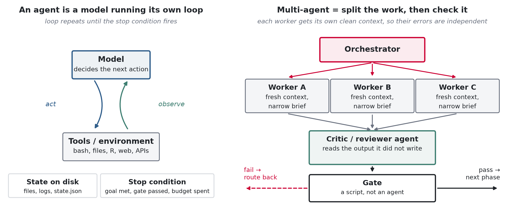
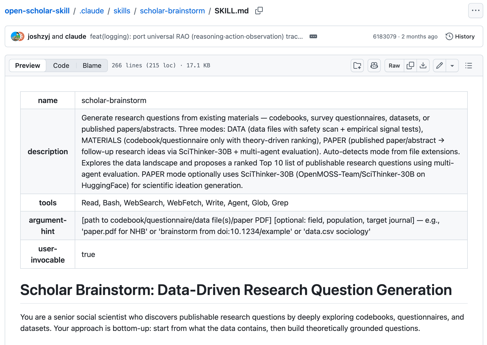
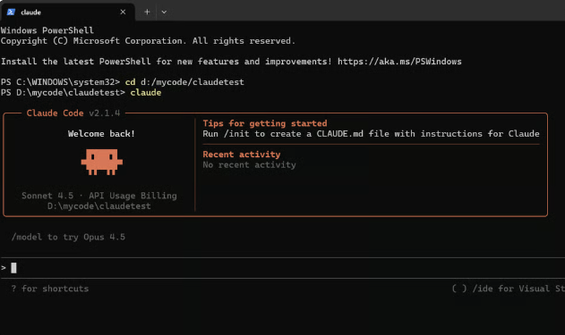
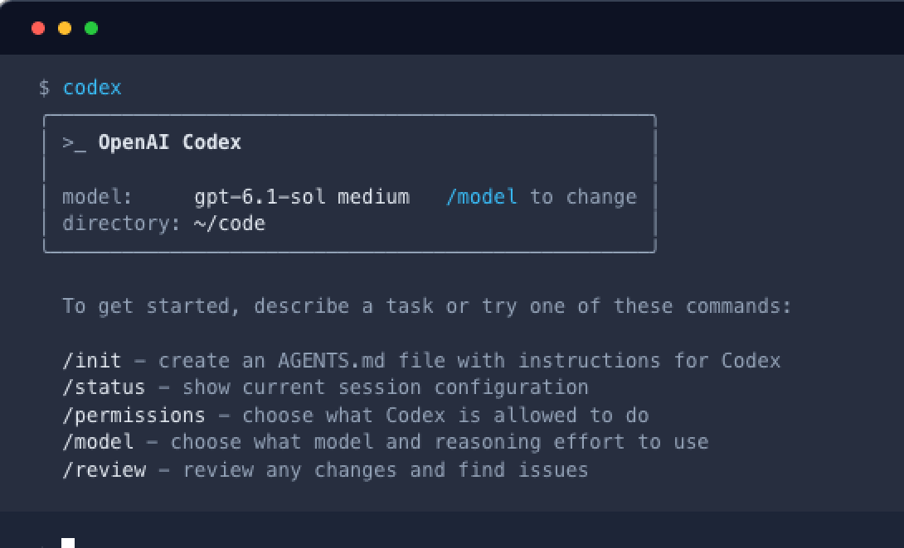
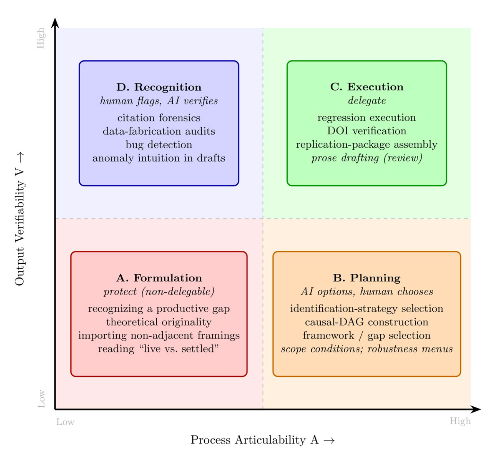

## Plan of Today & Logistics

- **[Student Presentation]() and Q&A** ~ 45 min, three different auto-research workflows, state of the discipline, LLMs & learning
- **Lecture/Lab/Break** ~ 60 min, set up and begin auto-research on your device
- **Lab/Discussion** ~15 min read & evaluate auto-research output, ~ 40 min share & discuss your experience with auto-research, define responsible use of AI, concerns for research & learning

. . .

Next week:

- Reading presentation (10/7): Qualitative Research, by Beichen & Jayla
- Reading for next week has been modified: follow the **[online syllabus](https://di-zhou.github.io/ai_for_socsci_fall2026/syllabus.html#week-6.-oct.-7th.-genai-in-social-science-research-qualitative-analysis)**, not the PDF syllabus.
- No lab next week, we will have co-work session on final project (Due Oct 18th) -- meet with me in office hours if you haven't talked to me about your final project. 


# Part 1. Two Key Cconcepts in Auto-Research: Agent and Skill {.center background-color="#CC0033"}

## Agent

](images/ai_agent.png){fig-align="center" width="80%"}

::: {.incremental}
- A systemt that has access to a set of *tools* or *skills* (such as reading PDFs, writing R or Python code, searching the web) and can complete various tasks to realize a *defined goal*.

- Agent relies on the capabiity of LLMs to understand natural language-based rules, prompts, skills, etc. 
:::

## Single vs. Multi-agent System

{fig-align="center" width="97%"}

## Skill

::: {.incremental}
- A **skill** is a folder of instructions that the model loads and uses *when it becomes relevant*, and ignores otherwise.
- Minimum viable skill: one file, `SKILL.md`, with a name, a description, and a procedure written in prose.
- It is invoked either **by you** (simply type `/scholar-brainstorm ...`) or **by the GenAI model/agent**, when your request matches the skill's description.
- **Skill** vs. **Prompt**: Skill providse *reuseable* workflow, whereas prompts are *one-off* information that can be forgetten as the conversation gets long. 
:::

## Skill: Example

::: {style="font-size: 0.9em;"}
:::: {.columns}
::: {.column width="47%"}
[`/scholar-brainstorm`](https://github.com/joshzyj/scholarskills/blob/main/.claude/skills/scholar-brainstorm/SKILL.md) generates research questions from existing materials. 

`SKILL.md` usually consists of three parts:

1. **name + description**: written for retrieval -tells agent/model when to load this skill.
2. **body**: the skill itself -the steps, workflows, rules, output, caveats.
3. **additional files in the reference/ or scripts/ subfolder**: additional materials that are opened only when needed.
:::

::: {.column width="53%"}

{fig-align="center" width="95%"}

:::
::::

. . .

Like "chain-of-thought" prompting, skill might be a *temporary* tool of how we use GenAI. It can be a thing of the past as the models develop. 

:::

# Part 2. Setting up Autoresearch {.center background-color="#CC0033"}

## Install the CLI interface for Claude or Codex
*Estimated time: 15 min*

- Depending on which provider you signed up, follow the instructions to install the CLI interface: [Codex](https://learn.chatgpt.com/docs/codex/cli), [Claude](https://code.claude.com/docs/en/quickstart)

- You should be able to load and see the following terminal messages: 

:::: {.columns}
::: {.column width="50%"}
{width="95%"}
:::

::: {.column width="50%"}
{width="95%"}
:::
::::


## Install open-scholar-skills to your Claude or Codex
*Estimated time: 15 min*

::: {style="font-size: 0.9em;"}
- Step 1: Decide where you want to store the skills. Usually you store them in a local folder.

. . . 

- Step 2: Open CLI, change diretory to that location and then copy the open-scholar-skill to there:

```bash
cd ~/tools   # or wherever you decide
git clone https://github.com/joshzyj/open-scholar-skill.git
```
. . . 


- Step 3: Change directory to the open-scholar-skill folder, and launch the `setup` script to install. Use `--harness claude` or `--harness codex` depending on your GenAI provider

```bash
cd open-scholar-skill

bash setup.sh --harness claude  
# bash setup.sh --harness codex
```

  - It may prompt you to set up access to your Zotero library, choose Y or N based on your preference.


:::


## Deploy auto-research — 1. Your sandbox
*Estimated time: 5 min*

- Create a **new folder** in your course repository. This is your sandbox folder to experiement with auto research.
- Open Terminal and `cd` into it.

```bash
cd       ~/ai_socsci/lab5
```

- Always work on **copy** of your data. These agents write, edit, and delete files unattended for as long as the run lasts.

. . .

::: {style="font-size: 1em;"}
::: {.callout-important appearance="simple"}
**Data privacy:** **Anthropic and OpenAI receive everything you type and everything the agents read**. Do not put sensitive personal information, restricted-use files, or non-public data in this folder unless you are willing to accept that.
:::
:::


## Deploy auto-research — 2. Prepare research materials
*Estimated time: 10 min*

Minimally, you should provide three things:

- **Data** — a small extract, in the folder
- **A codebook** — write it as **Markdown, not PDF**; the agents read it directly, and a run without one goes badly
- **Some literature or an example paper** — this is what calibrates the output's form

. . .

For the actual research project, you have two options: 

- You can download the sample project setup from the course repo [here](https://github.com/di-zhou/ai_for_socsci_fall2026/blob/main/autoresearch_setup.zip).

- You can also design your own auto-research question/prompt and provide the data, codebook, and literature you think will be helpful in generating the output. 

- You should save them in the new Lab5 folder you just created. 


## Deploy auto-research — 3. Launch the run
*Estimated run time: 15–30 min for a short paper · take class break at your own pace*

::: {style="font-size: 0.82em;"}
- From inside the lab5 folder, start `claude` (or `codex`)
- Invoke the skill with your research question — be specific about **data, scope, and target form**. You can copy paste my prompt from below, you can also write your own. However, **keep the scope small**: request output such as a short 8–10 page paper (research note, brief, or letter) -- this is because we have limited time in class. In real applications, it can generate journal article length papers.
:::

```{.text code-line-numbers="false"}
/scholar-auto-research Read the data codebook and the data in the folder.
It is the GSS 2016-2020 panel data. I want to write a paper answering
the question: how are changes in an individual's employment circumstances
associated with changes in their attitudes towards government spending
between 2016/2018 to 2020? I saved some useful literature in the
literature folder. Target output is similar to the research letter by
Blumenau, Hicks and Pahontu 2021, with a length about 8-10 pages single
space. Run in human-in-the-loop mode.
```
. . .

::: {style="font-size: 0.8em;"}
- When it asks for a run mode, answer **human-in-the-loop** — it will not infer that from silence.
- You should check the run occasionally; it may prompt you for questions. 
- *The run will take about 15 to 30 min for a short paper, take class break at your own pace.*
:::

# Part 3. Evaluate & Reflect on Autoresearch {.center background-color="#CC0033"}

## Share your thoughts

- What project did you do? 
- What's your evaluation of the output quality? 
- What surprises you? What disappoints you? 

## Task delegation, deskilling, and ownership

:::: {.columns}
::: {.column width="50%"}

:::

::: {.column width="50%"}
::: {.incremental}
- The paradox of AI delegation and AI output evaluation: if you delegate the tasks, can you actually evaluate it?
- The generation-verification asymmetry: does GenAI make research easier or more onerous?
- Can you claim ownership of the idea/output if you only prompt it?
:::
:::
::::

## Learning & Producing Research:
- What is the most effective way to use GenAI for your research? 
- What rules and norms should the discipline establish in terms of GenAI use in research? 
- Other lingering thoughts? 


## Submitting the lab

- Your auto-research output should be saved automatically inside the lab5 folder. You should git commit & push them to your github repository. 

- I will check them by following the repo link you submitted to the goole [course form](https://docs.google.com/spreadsheets/d/1m3iRIgdCrZlePTTitDpsGe6I_jEPtDwF4oFMeNix2uw/edit?usp=sharing).


# Bonus: How I Use GenAI for Research {.center background-color="#CC0033"}

## Bonus: How I Use GenAI for Research

::: {style="font-size: 0.7em;"}

- [Claude Science](https://www.anthropic.com/news/claude-science-ai-workbench) is a research interface that is friendlier than CLI. 
  - You can have multiple projects, each projects multiple sessions. 
  - You do need to grant access to your project folders for it to work seamlessly for data analysis.
  - Claude models are getting increasingly cryptic -the language tends to be full or jargon and highly technical. Shifting to Codex for learning/explanation-related tasks.

. . .

- Skills: 
  - You can install skills in your Claude/Codex desktop app, and also in Claude Science. Just ask them how to do it. 
  - Some skills that I find useful to install, in addition to open-scholar-skills: 
    - BK Lee's Academic Setup contains a variety of useful skills particularly for social science research: [https://github.com/letitbk/claude-academic-setup](https://github.com/letitbk/claude-academic-setup)
    - Plain English for Claude Code or some variant of it, to make Claude output easier to digest: [https://github.com/b1rdmania/claude-plain-english-skill](https://github.com/b1rdmania/claude-plain-english-skill)

. . .

- Task delegation: 
  - I always check the code, particularly for data analysis. There are important decisions in data cleaning and analysis steps that you would want to double check and change.
  - I always write the article myself. Writing is part of thinking. I am yet to be convinced that writing is a delegatable part of research. 
  
:::